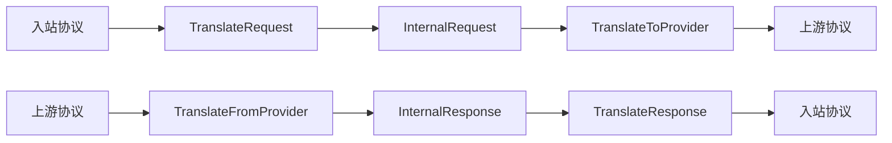
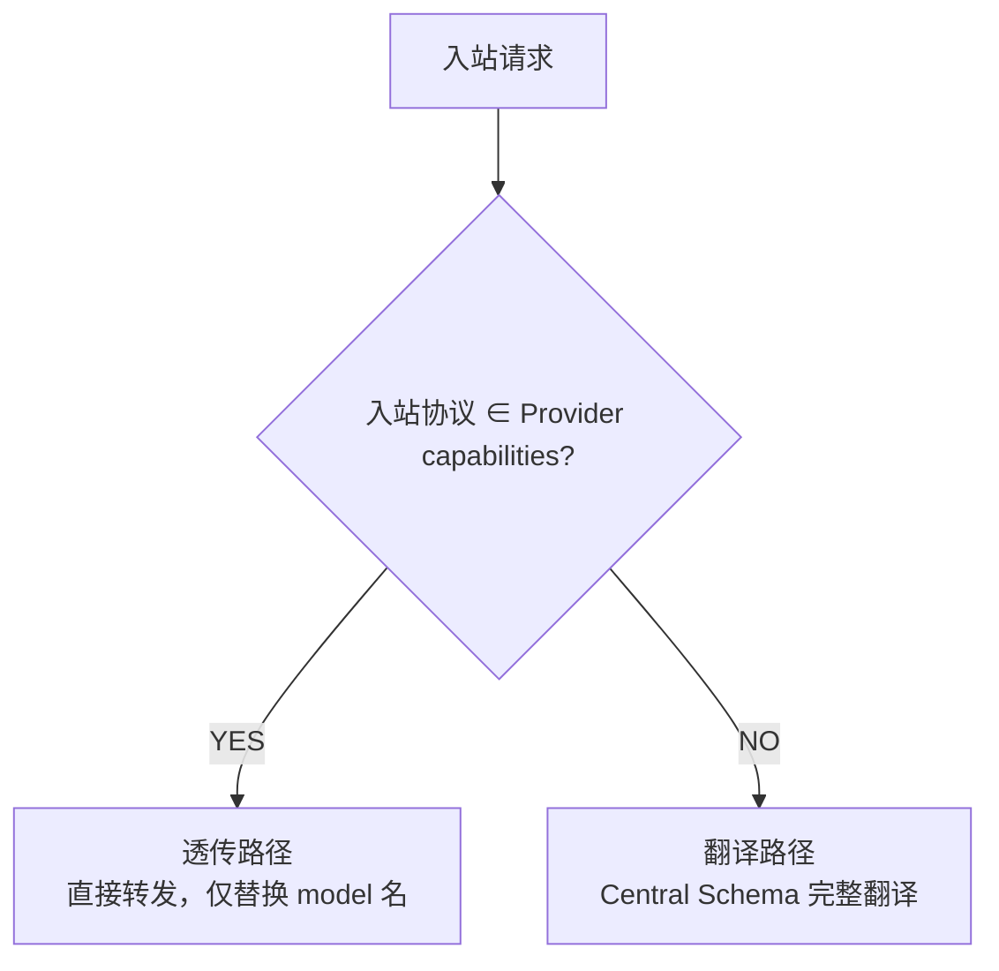
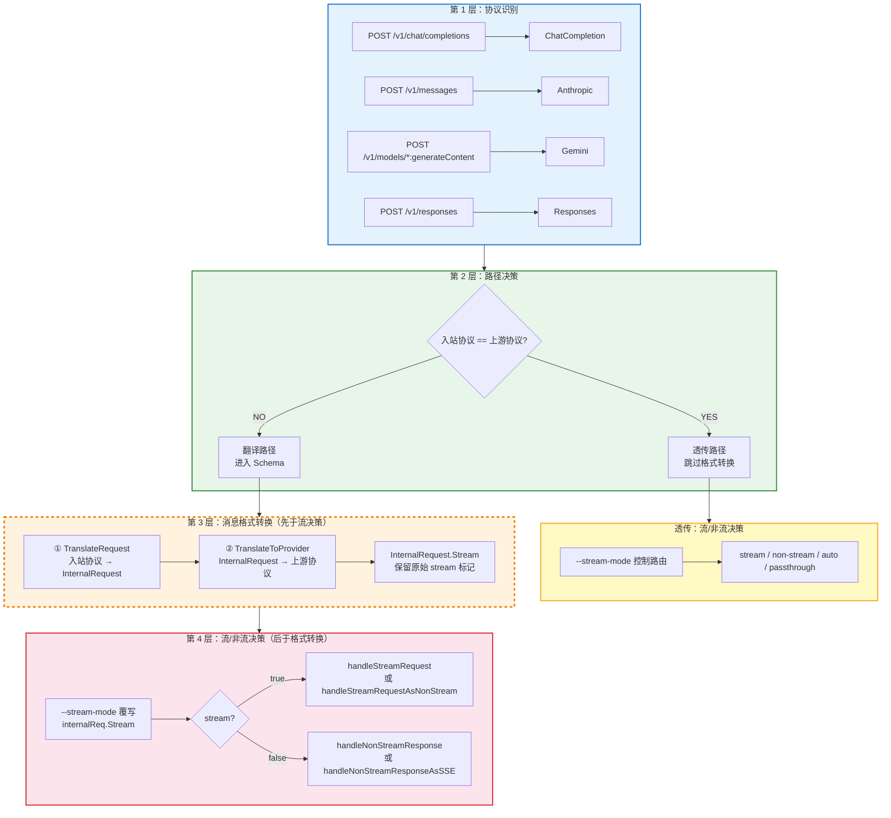

# CLAUDE.md — Agent-Proxy AI 开发上下文

> 面向 AI 辅助开发（Claude Code），帮助快速理解核心协议转换逻辑。
>
> **完整内容见 [AGENTS.md](AGENTS.md)**，本文件与其保持同步。
> 详细设计见 [docs/DESIGN.md](docs/DESIGN.md)，用户手册见 [MANUAL.md](MANUAL.md)。

---

## 项目定位

4×4 AI 协议网关 — 将 OpenAI / Anthropic / Gemini / Responses 四种协议互相转换，客户端无感知。纯 Go + 内嵌 SQLite。

---

## 核心协议转换逻辑

### Central Schema（翻译中枢）

**所有协议互转必须经过 Central Schema，禁止协议 A 直接翻译到协议 B。**



### 路由决策：透传 vs 翻译



| 路径 | 触发条件 | 处理方式 |
|------|---------|---------|
| 透传 | 入站协议 == 上游协议 | 请求体原样转发，响应体原样回传（或 SSE 包装），零损耗 |
| 翻译 | 入站协议 != 上游协议 | TranslateRequest → InternalRequest → TranslateToProvider → 调用上游 → TranslateFromProvider → InternalResponse → TranslateResponse |

### 处理流水线顺序

**翻译路径中，消息格式转换先于流/非流决策：**



> `InternalRequest.Stream` 在 TranslateRequest 阶段从入站协议提取并保留，传递到第 4 层供 `--stream-mode` 覆写。

### `--stream-mode` 流式策略控制

四种模式：`auto`（默认自适应）、`stream`（强制 SSE）、`non-stream`（强制非流式）、`passthrough`（直连）。

**透传路径**：根据模式和请求体 `stream` 字段选择 handler（`handlePassthroughStream`/`NonStream`/`NonStreamAsSSE`/`Raw*`）。

**翻译路径**：覆写 `internalReq.Stream` 后再路由：

| 模式 | 入站 stream | 上游 stream（覆写后） | 处理函数 |
|------|------|------|------|
| `auto` | true | true | `handleStreamRequest` |
| `auto` | false | false | `handleNonStreamResponse` |
| `non-stream` | true | false | `handleNonStreamResponseAsSSE` |
| `non-stream` | false | false | `handleNonStreamResponse` |
| `stream` | true | true | `handleStreamRequest` |
| `stream` | false | true | `handleStreamRequestAsNonStream` |

> `passthrough` 模式仅在透传路径生效，翻译路径忽略。

---

## 关键源码文件

| 文件 | 职责 |
|------|------|
| `internal/server/quick.go` | 快速模式核心：路由决策、透传/翻译分发、SSE 包装、心跳、自适应探测 |
| `internal/provider/openai.go` | HTTP 客户端：四种协议的 Call/CallStream |
| `internal/protocol/schema/internal.go` | Central Schema 定义（InternalRequest/InternalResponse） |
| `internal/protocol/<name>/translator.go` | 各协议翻译器（实现 CombinedTranslator 接口） |
| `internal/translator/interfaces.go` | CombinedTranslator 接口定义 |
| `internal/db/aliasfile.go` | 模型别名：三层加载、DefaultAliases()、双向替换 |

---

## 关键约定

### 协议翻译
- **禁止协议 A 直接翻译到协议 B**，必须经过 Central Schema
- 新增协议需实现 `CombinedTranslator` 接口，在 `gateway.go` 注册

### SSE 格式
- 所有 SSE 数据行必须带 `data: ` 前缀
- 心跳格式：`data: {}\n\n`（合法 JSON `{}`，兼容 Claude Code 和 Kimi）
- 错误事件：`{"type":"error","error":{"type":"...","message":"..."}}`
- Anthropic 事件字段合规性见 `docs/DESIGN.md`

#### Anthropic SSE 事件生命周期

**必须严格遵循 Anthropic 协议的完整事件序列：**

```
message_start → content_block_start → content_block_delta* → content_block_stop → message_delta → message_stop
```

关键约束：
- `message_start` 的 `message.content` 必须序列化为 `[]`（空数组），不能为 `null`
- `content_block_start` 必须包含 `citations: []`（空数组），不能省略该字段
- `content_block_start` 必须在第一个 `content_block_delta` 之前发送
- `content_block_stop` 必须在 `message_delta` 之前发送
- 流被取消（`ctx.Done()`）时也必须发送 `content_block_stop` 再结束

这些约束在 [internal/protocol/anthropic/translator.go](internal/protocol/anthropic/translator.go) 的 `TranslateStream` 中通过 `blockStarted` 状态标记实现。

### HTTP 连接
- 非流式请求使用独立 `http.Client`，与 SSE 连接池隔离
- 非流式防超时：先 `WriteHeader(200)` + `Flush()` 启用 chunked transfer
- `--timeout` 控制上游超时（秒），默认 300

### 模型别名
- 三层加载：`--aliases` > `model-aliases.yaml` > 内置 `DefaultAliases()`
- 双向替换：请求 `model` 假→真，响应 `model` 真→假
- `_default_` 兜底，`@default` 动态取上游首个模型

---

## 相关文档

| 文档 | 内容 |
|------|------|
| [docs/DESIGN.md](docs/DESIGN.md) | 底层机制、协议处理流、消息转换图、扩展开发 |
| [MANUAL.md](MANUAL.md) | 安装、使用、CLI 参考、故障排查 |