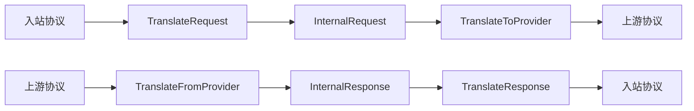
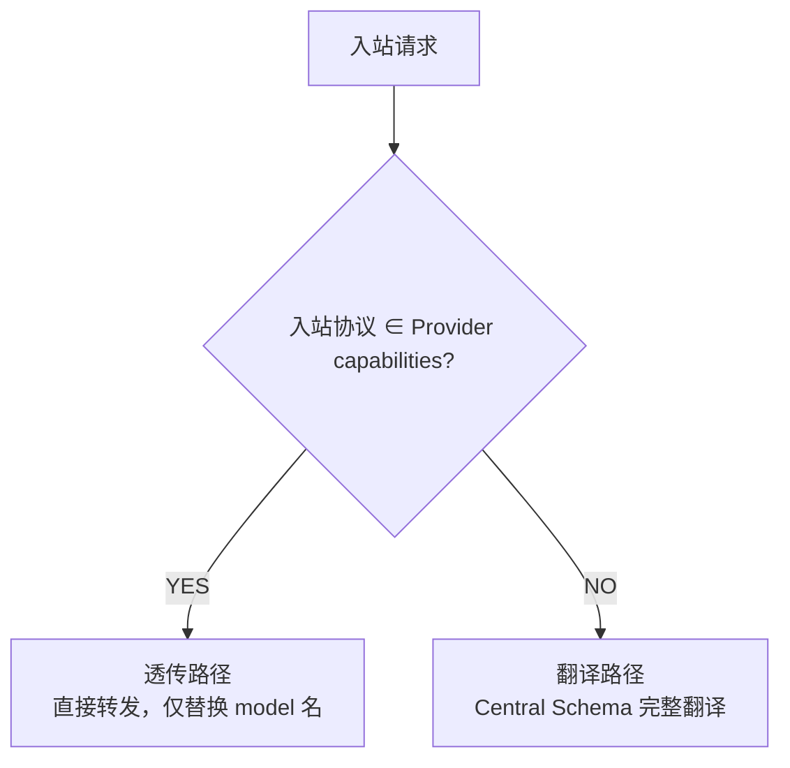
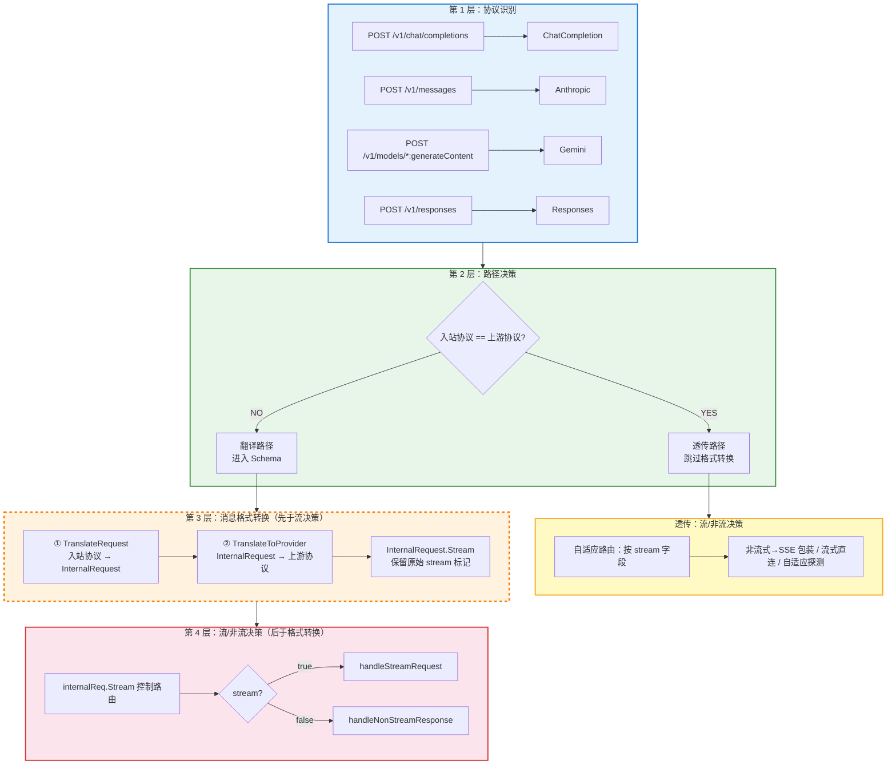

# CLAUDE.md — Agent-Proxy AI 开发上下文

> 面向 AI 辅助开发（Claude Code），帮助快速理解核心协议转换逻辑。
>
> **完整内容见 [AGENTS.md](AGENTS.md)**，本文件与其保持同步。
> 详细设计见 [docs/DESIGN.md](docs/DESIGN.md)，用户手册见 [MANUAL.md](MANUAL.md)。

---

## 项目定位

4×4 AI 协议网关 — 将 OpenAI / Anthropic / Gemini / Responses 四种协议互相转换，客户端无感知。纯 Go + 内嵌 SQLite。

---

## 核心协议转换逻辑

### Central Schema（翻译中枢）

**所有协议互转必须经过 Central Schema，禁止协议 A 直接翻译到协议 B。**



### 路由决策：透传 vs 翻译



| 路径 | 触发条件 | 处理方式 |
|------|---------|---------|
| 透传 | 入站协议 == 上游协议 | 请求体原样转发，响应体原样回传（或 SSE 包装），零损耗 |
| 翻译 | 入站协议 != 上游协议 | TranslateRequest → InternalRequest → TranslateToProvider → 调用上游 → TranslateFromProvider → InternalResponse → TranslateResponse |

### 处理流水线顺序

**翻译路径中，消息格式转换先于流/非流决策：**



> `InternalRequest.Stream` 在 TranslateRequest 阶段从入站协议提取并保留，传递到第 4 层。

---

## 关键源码文件

| 文件 | 职责 |
|------|------|
| `internal/server/quick.go` | 快速模式核心：路由决策、透传/翻译分发、SSE 包装、自适应探测 |
| `internal/server/gateway.go` | 复杂模式核心：与 quick.go 功能对应，必须保持同步 |
| `internal/server/sse_heartbeat.go` | 统一 SSE 心跳 goroutine 工厂函数，所有 handler 共用 |
| `internal/provider/openai.go` | HTTP 客户端：四种协议的 Call/CallStream |
| `internal/protocol/schema/internal.go` | Central Schema 定义（InternalRequest/InternalResponse） |
| `internal/protocol/<name>/translator.go` | 各协议翻译器（实现 CombinedTranslator 接口） |
| `internal/translator/interfaces.go` | CombinedTranslator 接口定义 |
| `internal/db/aliasfile.go` | 模型别名：三层加载、DefaultAliases()、双向替换 |

---

## 关键约定

### 协议翻译
- **禁止协议 A 直接翻译到协议 B**，必须经过 Central Schema
- 新增协议需实现 `CombinedTranslator` 接口，在 `gateway.go` 注册

### SSE 格式
- 所有 SSE 数据行必须带 `data: ` 前缀
- 心跳格式：`: heartbeat\n\n`（SSE 注释，RFC 6455 §3.4）
  - 不可用 `data: {}\n\n`（Claude Code 解析为 Anthropic 事件，缺少 type 字段→失败）
  - 不可用 `data: \n\n`（Kimi 等严格客户端空 data 行 JSON.parse 报错）
- 错误事件：`event: error\ndata: {"type":"error","error":{"type":"...","message":"..."}}\n\n`
- Anthropic 事件字段合规性见 `docs/DESIGN.md`

#### Anthropic SSE 事件生命周期

**必须严格遵循 Anthropic 协议的完整事件序列：**

```
message_start → content_block_start → content_block_delta* → content_block_stop → message_delta → message_stop
```

关键约束：
- `message_start` 的 `message.content` 必须序列化为 `[]`（空数组），不能为 `null`
- `content_block_start` 必须包含 `citations: []`（空数组），不能省略该字段
- `content_block_start` 必须在第一个 `content_block_delta` 之前发送
- `content_block_stop` 必须在 `message_delta` 之前发送
- 流被取消（`ctx.Done()`）时也必须发送 `content_block_stop` 再结束

这些约束在 [internal/protocol/anthropic/translator.go](internal/protocol/anthropic/translator.go) 的 `TranslateStream` 中通过 `blockStarted` 状态标记实现。

### HTTP 连接
- 非流式请求使用独立 `http.Client`，与 SSE 连接池隔离
- 非流式防超时：先 `WriteHeader(200)` + `Flush()` 启用 chunked transfer
- `--timeout` 控制上游超时（秒），默认 300

### 模型别名
- 三层加载：`--aliases` > `model-aliases.yaml` > 内置 `DefaultAliases()`
- 双向替换：请求 `model` 假→真，响应 `model` 真→假
- `_default_` 兜底，`@default` 动态取上游首个模型

### 版本标识
- `main.go` 中 `var version = "vX.Y.Z"`，可通过 `-ldflags "-X main.version=vX.Y.Z"` 构建时注入
- 每次发布必须更新版本号，同步更新 `main.go` 中的 `version` 变量
- 启动日志（快速/复杂模式）均显示版本号，如 `🚀 Agent-Proxy v0.2.55 (快速模式) running on ...`
- 支持 `agent-proxy --version` / `agent-proxy -V` / `agent-proxy version` 查看版本

### 双模式同步：quick.go ↔ gateway.go

**quick.go（快速模式）和 gateway.go（复杂模式）必须保持同步。** 所有修复必须同时应用到两个文件，否则会出现「修 A 坏 B」的顾此失彼情况。

**已知不一致点（已修复）：**
- 心跳机制：gateway.go 已补全 `callDone`/`callFinished` 同步
- SSE 换行符：gateway.go 已修复 `\n` → `\n\n `
- SSE 前缀：gateway.go 已补全 `data: ` 前缀自动检测
- Thinking 过滤：gateway.go 已补全非流式 `stripThinkingContentBlocks` + 流式过滤
- Chunked Transfer：gateway.go 已补全 `WriteHeader(200)` + `Flush()` 在 CallStream 前
- SSE 错误事件：gateway.go 已改用 `event: error` 而非 `sendError`

**修改检查清单：** 修改任一下列函数时，必须同步修改另一文件中的对应函数：
| quick.go | gateway.go |
|----------|------------|
| `handlePassthroughStreamWithBody` | `handlePassthroughStream` |
| `handleStreamRequest` | `handleStreamRequest` |
| `handlePassthroughNonStream` | `handlePassthroughNonStream` |

### @AI_GUARD 代码标记系统

**代码中关键约束位置使用 `@AI_GUARD` 标记，防止 AI/LLM 盲目修改导致「顾此失彼」。**

标记格式：
```
// @AI_GUARD: <类别> - <简述>
// @CONSTRAINT: <硬约束，修改前必须检查>
// @RELATED: <关联文件或函数>
// @REASON: <历史原因/血泪教训>
```

**查找所有标记：**
```bash
grep -rn "@AI_GUARD:" internal/
grep -rn "@CONSTRAINT:" internal/
grep -rn "@REASON:" internal/
```

**已标记的关键约束点（共 50 个）：**

| 类别 | 文件 | 约束 |
|------|------|------|
| `TRANSLATOR_INTERFACES` | interfaces.go | 翻译器接口定义，新增协议必须实现全部方法 |
| **Central Schema（消息格式定义）** | | |
| `CENTRAL_SCHEMA` | schema/internal.go | 中枢消息模型，所有协议翻译的中枢 |
| `INTERNAL_MESSAGE` | schema/internal.go | 中枢消息对象，字段变更必须同步所有翻译器 |
| `INTERNAL_CONTENT_BLOCK` | schema/internal.go | 多模态内容块，图片/文件格式汇聚点 |
| `INTERNAL_TOOL` | schema/internal.go | 工具定义，各协议 tool 格式差异汇聚点 |
| `INTERNAL_REQUEST` | schema/internal.go | 中枢请求对象，所有入站翻译目标结构 |
| `INTERNAL_RESPONSE` | schema/internal.go | 中枢响应对象，所有出站翻译源结构 |
| `INTERNAL_STREAM_EVENT` | schema/internal.go | 流式事件，所有流式翻译中转结构 |
| **ChatCompletionTranslator** | | |
| `CC_TRANSLATE_REQUEST` | chatcompletion/translator.go | CC → InternalRequest 消息格式转换 |
| `CC_TRANSLATE_RESPONSE` | chatcompletion/translator.go | InternalResponse → CC 消息格式转换 |
| `CC_TRANSLATE_STREAM` | chatcompletion/translator.go | CC SSE 流式出口 |
| **AnthropicTranslator** | | |
| `ANTHROPIC_TRANSLATE_REQUEST` | anthropic/translator.go | Anthropic → InternalRequest 消息格式转换 |
| `ANTHROPIC_TRANSLATE_RESPONSE` | anthropic/translator.go | InternalResponse → Anthropic 消息格式转换 |
| `ANTHROPIC_TRANSLATE_STREAM` | anthropic/translator.go | SSE 事件生命周期 |
| `MESSAGE_START_CONTENT` | anthropic/translator.go | Content 必须 `[]ContentBlock{}` |
| `CONTENT_BLOCK_START_BEFORE_DELTA` | anthropic/translator.go | `citations: []` 必须存在 |
| `TRANSLATE_STREAM_EVENT` | anthropic/translator.go | 上游 Anthropic SSE → InternalStreamEvent |
| **GeminiTranslator** | | |
| `GEMINI_TRANSLATE_REQUEST` | gemini/translator.go | Gemini → InternalRequest 消息格式转换 |
| `GEMINI_TRANSLATE_RESPONSE` | gemini/translator.go | InternalResponse → Gemini 消息格式转换 |
| `GEMINI_TRANSLATE_STREAM` | gemini/translator.go | Gemini SSE 流式出口 |
| `GEMINI_TRANSLATE_STREAM_EVENT` | gemini/translator.go | 上游 Gemini SSE → InternalStreamEvent |
| **ResponsesTranslator** | | |
| `RESPONSES_TRANSLATE_REQUEST` | responses/translator.go | Responses → InternalRequest 消息格式转换 |
| `RESPONSES_TRANSLATE_RESPONSE` | responses/translator.go | InternalResponse → Responses 消息格式转换 |
| `RESPONSES_TRANSLATE_STREAM` | responses/translator.go | Responses SSE 流式出口 |
| `RESPONSES_TRANSLATE_STREAM_EVENT` | responses/translator.go | 上游 Responses SSE → InternalStreamEvent |
| **模型别名** | | |
| `ALIAS_RESOLVE` | db/aliasfile.go | 别名解析核心，三层优先级 |
| `ALIAS_LOAD_AUTO` | db/aliasfile.go | 别名文件自动加载 |
| `DEFAULT_ALIASES` | db/aliasfile.go | 内置别名，三层加载最底层兜底 |
| **quick.go 核心功能** | | |
| `HANDLE_REQUEST_ENTRY` | quick.go | 快速模式总入口，所有路由决策起点 |
| `STREAM_MODE_ROUTING` | quick.go | 透传路径自适应路由（按 stream 字段） |
| `TRANSLATE_TO_PROVIDER` | quick.go | InternalRequest → 上游协议请求 |
| `PASSTHROUGH_NONSTREAM` | quick.go | 透传非流式 |
| `PASSTHROUGH_NONSTREAM_AS_SSE` | quick.go | 透传非流式→SSE 包装，必须 <-callFinished 防并发写 |
| `PASSTHROUGH_STREAM` | quick.go | 透传流式 |
| `NONSTREAM_RESPONSE` | quick.go | 翻译路径非流式→JSON |
| `NONSTREAM_RESPONSE_AS_SSE` | quick.go | 翻译路径非流式→SSE |
| `HANDLE_STREAM_REQUEST` | quick.go | 翻译路径流式处理 |
| `STREAM_REQUEST_AS_NONSTREAM` | quick.go | 流式→非流式 JSON |
| `NONSTREAM_AS_SSE` | quick.go | 4 种协议拆分逻辑 |
| `SSE_HEARTBEAT_FORMAT` | quick.go | 心跳格式 |
| `SSE_HEARTBEAT_FACTORY` | sse_heartbeat.go | 统一心跳工厂函数，所有 handler 共用 |
| `THINKING_BLOCK_FILTER` | quick.go | thinking 块过滤 |
| `TRANSLATE_STREAM_EVENT_SIGNATURE` | quick.go | 签名必须 `json.RawMessage` |
| `TRANSLATE_STREAM_OUTPUT` | quick.go | Anthropic SSE 事件序列 |
| **gateway.go** | | |
| `GATEWAY_HANDLE_REQUEST_ENTRY` | gateway.go | 复杂模式总入口，必须同步 quick.go |
| `GATEWAY_TRANSLATE_TO_PROVIDER` | gateway.go | Central Schema 出口，必须同步 quick.go |
| `BUILD_CC_REQUEST` | gateway.go | InternalRequest → CC 消息格式转换核心 |
| `GATEWAY_PASSTHROUGH_STREAM` | gateway.go | 必须同步 quick.go |
| `GATEWAY_STREAM_REQUEST` | gateway.go | 必须同步 quick.go |
| **provider** | | |
| `CONNECTION_POOL_CONFIG` | openai.go | 4 个 Provider 配置一致 |

---

## 相关文档

| 文档 | 内容 |
|------|------|
| [docs/DESIGN.md](docs/DESIGN.md) | 底层机制、协议处理流、消息转换图、扩展开发 |
| [MANUAL.md](MANUAL.md) | 安装、使用、CLI 参考、故障排查 |