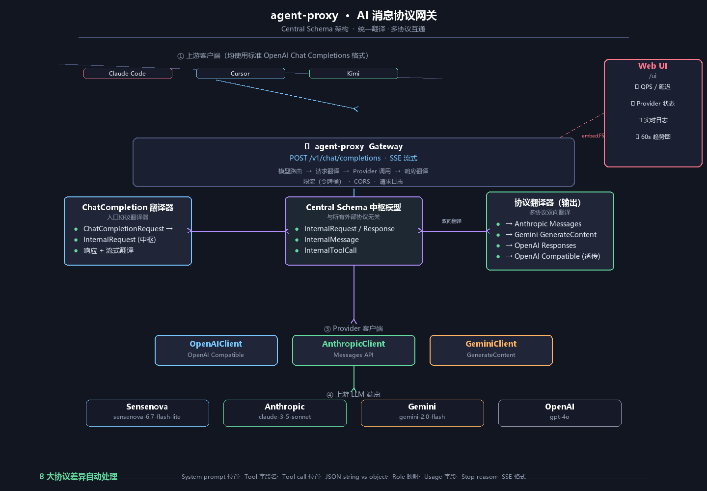

# agent-proxy — AI 消息协议网关

## 一句话

agent-proxy 是 AI 协议翻译的中间件：将上游 LLM 端点的 OpenAI / Anthropic / Gemini / Responses API **统一转化为 Chat Completions 格式**，让你用一个接口打通所有厂商。

三种模式覆盖所有场景：

- **快速模式**：`agent-proxy run --mode simple --db N` 一条命令从 SQLite 选记录启动
- **复杂模式**：`agent-proxy run --mode complex` 多 Provider 路由、Web UI 实时监控
- **配置文件**：`agent-proxy run --mode complex --conf config.json` 完整 JSON 配置

## 架构



### 核心模块

- **Central Schema**：与所有外部协议无关的统一消息模型，所有翻译通过此模型中转
- **Protocol Translators**：每个协议实现请求翻译 / 响应翻译 / 流式翻译
- **Provider Clients**：统一的下游调用接口
- **Model Router**：模型前缀匹配到 Provider
- **Web UI**：嵌入静态资源（embed.FS），实时指标推送

## 快速开始

```powershell
# === 1. 添加一个代理 ===
agent-proxy db add --url https://token.sensenova.cn/v1 \
                  --key sk-xxx --name sensenova

# === 2. 快速模式启动（从 DB 选一条记录）===
agent-proxy run --mode simple --host 0.0.0.0 --port 8080 --db 1

# === 3. 测试 ===
curl -X POST http://localhost:8080/v1/chat/completions \
  -H "Content-Type: application/json" \
  -d '{"model":"sensenova-6.7-flash-lite","messages":[{"role":"user","content":"hello"}]}'
```

## 命令总览

```
agent-proxy <subcommand> [options]

启动命令:
  agent-proxy run --mode simple --host <h> --port <p> --db <id>   快速模式
  agent-proxy run --mode complex --host <h> --port <p>             复杂模式（默认配置）
  agent-proxy run --mode complex --host <h> --port <p> --conf <f>  复杂模式（JSON 配置文件）

数据库命令:
  agent-proxy db list                                              列出所有记录
  agent-proxy db show <id>                                         显示详情
  agent-proxy db add --url <u> --key <k> [--name <n>] [--type <t>] 添加记录
  agent-proxy db rm <id>                                           删除记录

帮助:
  agent-proxy --help  /  -h                                        显示帮助
```

详细用法见 [MANUAL.md](MANUAL.md)。

## 快速模式 vs 复杂模式

| 维度 | 快速模式（`--mode simple`） | 复杂模式（`--mode complex`） |
|------|---------------------------|----------------------------|
| 启动方式 | `agent-proxy run --mode simple --db 1` | `agent-proxy run --mode complex` |
| Provider 来源 | SQLite 数据库一条记录 | 内置配置 或 `--conf` 配置文件 |
| 多 Provider | 不支持 | 支持（路由前缀匹配） |
| 协议翻译 | 支持（自动按 Provider 类型） | 支持（完整 4 协议） |
| Web UI | 无 | 有（`/ui`） |
| 限流 / 监控 | 无 | 有 |
| 适用场景 | 快速试用、单一端点 | 生产、多厂商调度 |

## 支持的协议

| 上游协议 | 网关端点 | 自动翻译 |
|---------|---------|---------|
| OpenAI Compatible | `POST /v1/chat/completions` | ✅ 透传 |
| Anthropic Messages | `POST /v1/messages` | ✅ 请求/响应/流式 |
| Google Gemini | `POST /v1/models/{model}:generateContent` | ✅ 请求/响应/流式 |
| OpenAI Responses | `POST /v1/responses` | ✅ 请求/响应/流式 |

## 协议兼容性差异点

agent-proxy 处理以下 8 大协议差异：

| # | 差异点 | 说明 |
|---|--------|------|
| 1 | System prompt 位置 | CC 在 messages 中；Anthropic 顶层 system；Gemini systemInstruction |
| 2 | Tool 定义字段 | parameters vs input_schema vs functionDeclarations |
| 3 | Tool call 位置 | CC 独立 tool_calls；Anthropic/Gemini 混在 content blocks |
| 4 | Tool call arguments | CC 是 JSON 字符串；其他是 JSON 对象 |
| 5 | Tool result 角色 | Anthropic 归 user；Gemini 归 user + functionResponse |
| 6 | Usage 字段名 | prompt_tokens vs input_tokens vs prompt_token_count |
| 7 | Stop reason | end_turn → stop；max_tokens → length |
| 8 | SSE 事件格式 | CC 无 event 行；Anthropic 用 type 字段 |

## 配置文件

复杂模式支持 `--conf` 指定 JSON 配置文件（参见 [`config.example.json`](config.example.json)）：

```json
{
  "server": { "host": "0.0.0.0", "port": 8080 },
  "providers": {
    "sensenova": {
      "base_url": "https://token.sensenova.cn",
      "api_token": "sk-xxx",
      "provider_type": "openai",
      "models": ["sensenova-6.7-flash-lite", "deepseek-v4-flash"]
    }
  },
  "model_router": {
    "model_to_provider": { "sensenova-": "sensenova" },
    "default_provider": "sensenova",
    "prefix_match": true
  }
}
```

## Web UI

复杂模式启动后访问 `http://localhost:8080/ui`，深色主题面板：

- **实时指标卡片**：QPS / P99 延迟 / 错误率 / 活跃连接
- **Provider 状态列表**：健康状态圆点（green/degraded/down/idle）
- **图表**：60 秒 QPS + 延迟趋势（uPlot）
- **请求日志**：SSE 推送，含模型/状态/耗时
- **数据接口**：`/ui/api/summary` `/ui/api/logs` `/ui/api/metrics` `/ui/api/providers`

## 性能与部署

- 单二进制部署（`embed.FS` 嵌入静态资源）
- 零外部依赖运行时（SQLite 为纯 Go 实现）
- 连接池 / 限流器（令牌桶）
- 优雅关闭（SIGINT / SIGTERM）

## 项目结构

```
agent-proxy/
├── cmd/
│   ├── server/main.go         # 入口：run/db/list/show/add/rm 子命令
│   └── cli.go                 # DB 管理实现
├── config.example.json        # 复杂模式配置文件示例
├── go.mod / go.sum
├── .env.example
├── README.md
├── MANUAL.md                  # 完整用户手册
└── internal/
    ├── config/config.go       # 配置结构 + JSON 加载
    ├── db/db.go               # SQLite 持久化
    ├── middleware/middleware.go
    ├── monitor/store.go
    ├── protocol/
    │   ├── schema/internal.go
    │   ├── chatcompletion/
    │   ├── anthropic/
    │   ├── gemini/
    │   └── responses/
    ├── provider/
    │   ├── provider.go
    │   └── openai.go
    ├── router/router.go
    ├── server/
    │   ├── gateway.go
    │   ├── quick.go
    │   └── ratelimiter.go
    ├── translator/interfaces.go
    └── web/
        ├── server.go
        └── static/
            ├── index.html
            ├── dashboard.css
            └── dashboard.js
```

## License

MIT
