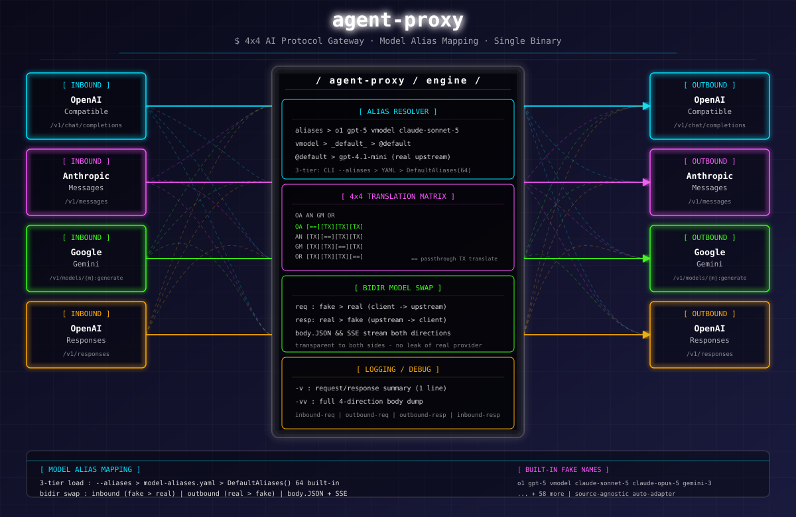

# agent-proxy — AI 协议网关

## 一句话

agent-proxy 是 AI 协议领域的 `/etc/hosts` + `翻译器`：单二进制，把 OpenAI / Anthropic / Gemini / Responses 四种 API 格式互相转换，加模型别名映射，让任何 agent 能用任何上游模型。

## 架构



- **翻译中枢**：Central Schema 统一表示，协议匹配时零开销透传，不匹配时走翻译
- **别名映射**：64 个内置假模型名 + `_default_=@default` 动态路由，换源自动适配
- **单二进制**：纯 Go 编译，内嵌 SQLite，无外部依赖

## 工作流

```
① 嗅探并添加代理 →  agent-proxy db add --url <u> --key <k>
② 启动网关       →  agent-proxy run --db 1
③ 任何协议调用    →  4 种协议入口同时监听，自动翻译到下游
④ 调试 / 监控    →  -v 摘要  /  -vv 四向全链路消息体  /  Web UI
```

| 阶段 | 动作 | 命令 |
|------|------|------|
| ① 嗅探 | 探测上游协议 + 模型，保存到 SQLite | `agent-proxy db add --url ... --key ...` |
| ② 启动 | 从 DB 选一条记录启动快速模式 | `agent-proxy run --db 1 [--key\|--nokey]` |
| ③ 调用 | 入站任何协议 → 自动翻译/透传 | `curl /v1/chat/completions` 等 4 个入口 |
| ④ 调试 | 两级日志 + 模型列表端点 | `-v` / `-vv` / `GET /v1/models?simple=1` |

***

## 快速开始

```powershell
agent-proxy db add --url https://token.sensenova.cn/v1 --key sk-xxx --name sensenova
agent-proxy run --db 1 --nokey
# 任意协议调用（OpenAI / Anthropic / Gemini / Responses 四个入口同时可用）
curl -X POST http://localhost:8080/v1/chat/completions ^
  -H "Content-Type: application/json" ^
  -d '{"model":"o1","messages":[{"role":"user","content":"hello"}]}'
```

> `o1` / `gpt-5` / `vmodel` 等均为假模型名，agent-proxy 自动解析映射到上游真实模型。完整命令、协议调用示例和故障排查见 [MANUAL.md](MANUAL.md)。

***

## 命令总览

```
agent-proxy [command]

命令组：
  run         启动网关（快速模式 --db / 复杂模式 --mode complex）
  db          代理数据库管理（增删查改 / 嗅探 / 有效性检查）
  detect      db add 的兼容别名（嗅探并新增代理）
  completion  生成 shell 自动补全脚本

全局选项：
  -v, -vv   日志级别（摘要 / 四向全链路消息体）
  --host    监听地址（默认 127.0.0.1）
  --port    监听端口（默认 8080）
```

详细用法见 [MANUAL.md](MANUAL.md)。

***

## 特性

| 特性 | 说明 |
|------|------|
| **4×4 协议互转** | OpenAI / Anthropic / Gemini / Responses 任意入站 → 任意出站 |
| **透传优化** | 入站协议与下游匹配时零开销直传，不做多余翻译 |
| **智能嗅探** | `db add` 自动探测所有支持的协议和模型，交互确认入库 |
| **快速模式** | `run --db <id>` 一条命令启动，零配置 |
| **复杂模式** | 多 Provider 路由前缀匹配、限流、Web UI 实时监控 |
| **单二进制** | 纯 Go 编译，内嵌 SQLite，无外部依赖 |
| **客户端认证** | 快速模式内置 Bearer Token（随机 / 指定 / 免密钥三选一） |
| **模型别名映射** | 64 个内置假模型名 + `_default_=@default` 动态上游路由 |
| **四向日志** | `-vv` 打印入站 / 上游请求 / 上游响应 / 出站完整消息体 |
| **Web UI** | 复杂模式下 `/ui`，深色主题面板：实时指标 / 请求日志 / Provider 状态 |

***

## 4×4 协议互转矩阵

| 入站 ↓ \ 出站 → | OpenAI CC | Anthropic | Gemini | Responses |
|---|---|---|---|---|
| **OpenAI CC** `/v1/chat/completions` | 透传 | 翻译 | 翻译 | 翻译 |
| **Anthropic** `/v1/messages` | 翻译 | 透传 | 翻译 | 翻译 |
| **Gemini** `/v1/models/{m}:generateContent` | 翻译 | 翻译 | 透传 | 翻译 |
| **Responses** `/v1/responses` | 翻译 | 翻译 | 翻译 | 透传 |

> 命中匹配项为「透传」：零开销直连，连 JSON 都不重解析；其余为「翻译」：经 Central Schema 双向转换。

***

## 模型别名映射

agent-proxy 内置一套假模型名到真实上游模型的映射机制，让任何 agent 里能直接写 `o1` / `gpt-5` / `claude-opus-4-5` / `vmodel` 等常见名字，而无需上游真的提供。

### 三层加载策略

| 优先级 | 来源 | 行为 |
|--------|------|------|
| 1 | `--aliases <file>` | CLI 显式指定的映射文件，优先级最高 |
| 2 | 同目录 `model-aliases.yaml` | 自动检测可执行文件同目录下的映射文件 |
| 3 | 代码内置 `DefaultAliases()` | 64 个常见假模型名 + `_default_=@default` 兜底 |

**加载规则**：高层存在时，**以内置 64 个别名为基础**，用高层条目覆盖。用户只需在 `model-aliases.yaml` 配 `_default_` 或少量别名，内置别名仍然生效。

### 映射值语法

| 语法 | 说明 |
|------|------|
| `@default` | 动态取上游 `/v1/models` 返回的**第一个**模型，换源自动适配 |
| `@db:<id>,<model>` | 指定 DB 记录编号对应的模型 |
| 纯字符串（如 `deepseek-v4-flash`） | 直接作为上游模型名使用 |

`_default_` 是特殊 key：所有未单独配置具体目标的别名，统一走 `_default_` 的值。

### 内置假模型名（64 个）

涵盖 Claude / Codex / GPT / o 系列 / DeepSeek / Gemini / Qwen / Doubao / GLM / SenseNova 等主流品牌，外加 `vmodel` 自定义占位。

### 自定义映射示例（`model-aliases.yaml`）

```yaml
# 所有未单独配置的别名，统一走这个上游模型
_default_:             deepseek-ai/deepseek-v4-flash-0731

# 单独指定：claude-opus-4-5 走另一个模型
claude-opus-4-5:       sensenova-6.7-flash-lite

# 动态取上游第一个模型（换源自动适配）
my-custom-model:       @default
```

> 仓库根目录下 `model-aliases.yaml` 为样板文件，全部默认注释；取消注释并修改值即可启用。

### 查看映射关系

启动后访问 `/v1/models?simple=1`（支持 `?key=<clientKey>` URL 参数，便于浏览器直接看）：

```
=== 上游模型 ===
sensenova-6.7-flash-lite
deepseek-v4-flash
...

=== 别名映射 ===
o1                 <-> deepseek-ai/deepseek-v4-flash-0731
gpt-5              <-> deepseek-ai/deepseek-v4-flash-0731
vmodel             <-> deepseek-ai/deepseek-v4-flash-0731
claude-opus-4-5    <-> sensenova-6.7-flash-lite
...
```

### 请求时的模型名替换

别名映射作用于**整个四向消息体**，不仅改 URL 路径：

| 方向 | 替换 | 说明 |
|------|------|------|
| 入站 → 上游（请求） | 假模型 → 真实上游模型 | 请求体 JSON 的 `model` 字段同步替换 |
| 上游 → 客户端（响应） | 真实模型 → 客户端原始假模型名 | 响应体 / SSE 每行 `model` 字段回显，终端无感知 |

> 客户端始终看到自己传入的假模型名，上游始终收到真实模型名，中间全链路自动替换。

## 项目结构

```
agent-proxy/
├── main.go                    # 入口 & 命令行分派
├── cmd/cli.go                 # db 命令实现
├── agent-proxy.yaml           # 复杂模式配置模板
├── model-aliases.yaml         # 别名映射样板文件
├── README.md                  # 本文件
├── MANUAL.md                  # 完整用户手册
└── internal/
    ├── config/                # 配置结构
    ├── db/
    │   ├── aliasfile.go       # 别名文件加载 + DefaultAliases 内置 64 个
    │   └── sqlite.go          # 代理数据库
    ├── protocol/              # 协议翻译器（chatcompletion/anthropic/gemini/responses）
    │   └── schema/            # Central Schema 统一消息结构
    ├── provider/              # 下游 Provider 客户端（Call / CallStream）
    ├── router/                # 模型路由
    ├── server/
    │   ├── quick.go           # 快速模式网关（别名解析 / 四向日志 / 模型替换）
    │   └── ...
    ├── translator/            # 翻译接口定义
    └── web/                   # Web UI
```

***

## 文档

| 文档 | 说明 |
|------|------|
| [README.md](README.md) | 快速概览、上手、命令总览 |
| [MANUAL.md](MANUAL.md) | 完整用户手册（协议兼容性、Web UI、扩展开发、故障排查） |
| [docs/DESIGN.md](docs/DESIGN.md) | 设计文档（底层机制、协议处理流、消息转换详解） |
| [AGENTS.md](AGENTS.md) | AI 开发上下文（Cursor、Copilot 等自动读取） |
| [CLAUDE.md](CLAUDE.md) | AI 开发上下文（Claude Code 自动读取，与 AGENTS.md 同步） |

> **注意：** [AGENTS.md](AGENTS.md) 和 [CLAUDE.md](CLAUDE.md) 内容一致，修改任一份时需同步更新另一份。AGENTS.md 供 Cursor、Copilot、Trae 等工具读取，CLAUDE.md 供 Claude Code 读取。

## License

MIT
