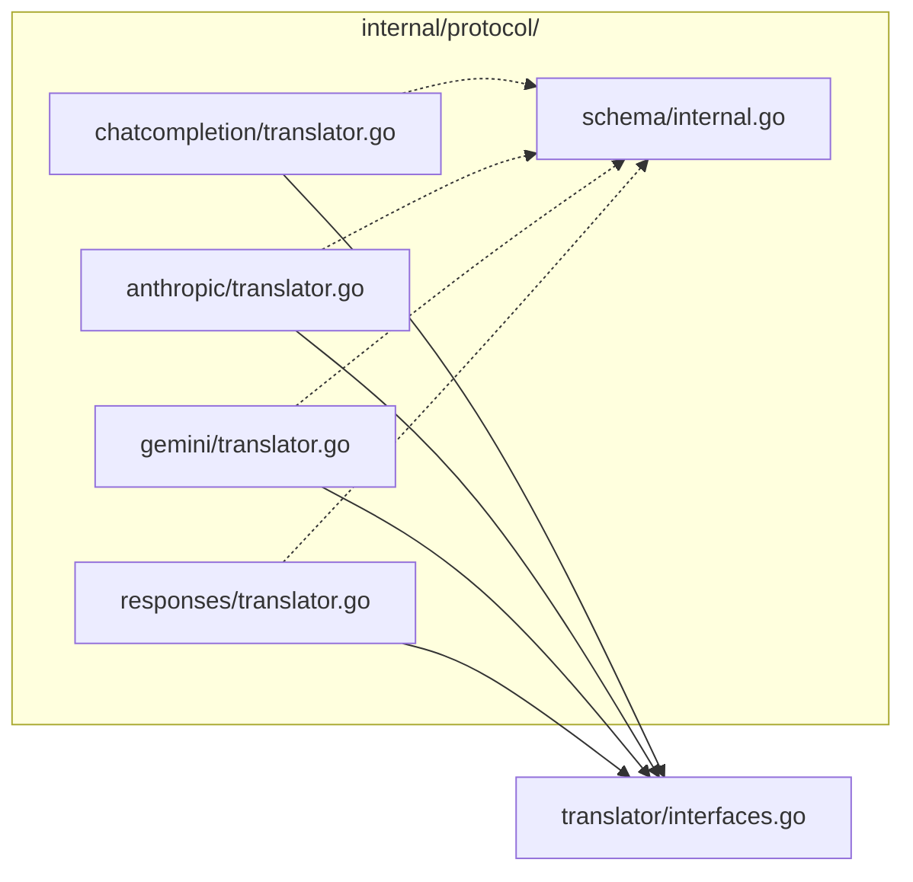
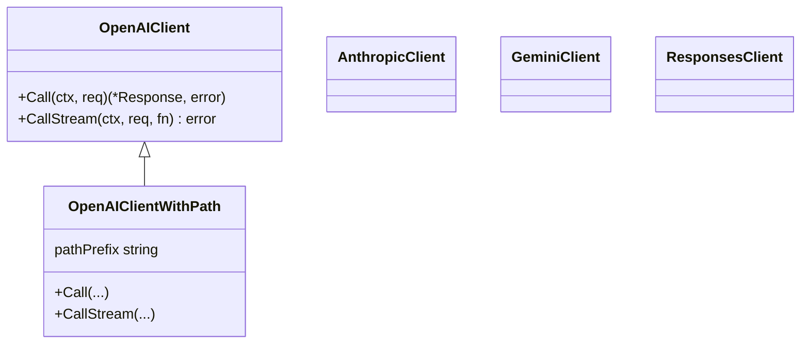
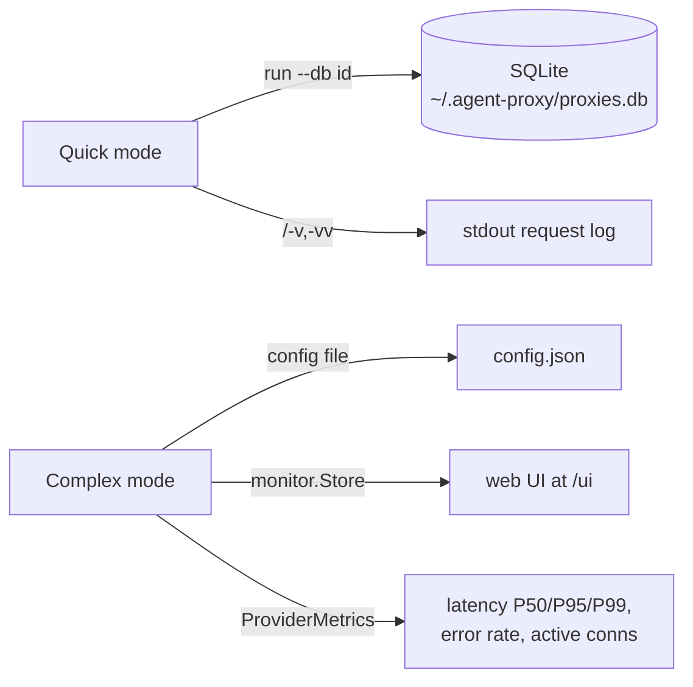

# Agent-Proxy — System Architecture

> A 4×4 AI protocol gateway written in pure Go with embedded SQLite.
> It transparently translates between four LLM APIs (OpenAI ChatCompletion, Anthropic Messages, Google Gemini, OpenAI Responses) so clients are protocol-agnostic.
>
> This document covers **what exists and where it lives**.
> Per-concept deep-dives live in the sibling docs:
> - [`REQUEST_LIFECYCLE.md`](REQUEST_LIFECYCLE.md) — request pipeline, routing, SSE
> - [`OPENAIPATH_CHAIN.md`](OPENAIPATH_CHAIN.md) — Google Gemini OpenAI-path propagation
> - [`PROTOCOL_COMPARISON.md`](PROTOCOL_COMPARISON.md) — per-protocol field/event differences
> - [`DESIGN.md`](DESIGN.md) — full design history & extended mechanism notes

---

## 1. Big-Picture Architecture

```mermaid
flowchart TB
    subgraph CLIENT["Clients (Claude Code / Codex / any AI tool)"]
        C1[CC client]
        C2[Anthropic client]
        C3[Gemini client]
        C4[Responses client]
    end

    subgraph PROXY["agent-proxy (in-process Go HTTP server)"]
        direction TB
        ROUTE[Route detection<br/>POST /v1/{...}]

        subgraph MODES["Two server modes"]
            QUICK[QuickGateway<br/>cmd/server/quick.go]
            GW[Gateway<br/>cmd/server/gateway.go]
        end

        subgraph TRANSLATION["Central Schema translation hub"]
            REG[TranslatorRegistry]
            CC[[CC translator]]
            AN[[Anthropic translator]]
            GM[[Gemini translator]]
            RS[[Responses translator]]

            IREQ[InternalRequest]
            IRESP[InternalResponse]
            ISEV[InternalStreamEvent]
        end

        subgraph MODELING["Model layer"]
            ALIAS[AliasFile<br/>3-layer alias resolve]
            ROUTER[ModelRouter]
        end

        subgraph PROVIDERS["Provider clients (internal/provider)"]
            P_CC[NewOpenAIClient<br/>/v1 default]
            P_CCX[NewOpenAIClientWithPath<br/>/v1beta/openai ...]
            P_AN[NewAnthropicClient]
            P_GM[NewGeminiClient]
            P_RS[NewResponsesClient]
        end
    end

    subgraph DB["SQLite (~/.agent-proxy/proxies.db)"]
        TBL[proxies table<br/>ProxyRecord incl. openai_path]
    end

    CLIENT --> ROUTE
    ROUTE --> MODES
    MODES --> ROUTER
    ROUTER --> ALIAS
    MODES --> PROVIDERS
    PROVIDERS --> EXT[<b>Upstream LLM APIs</b>]

    ROUTE -. passthrough .-> PROVIDERS
    MODES -- translate --> TRANSLATION
    TRANSLATION --> REG
    REG --> CC & AN & GM & RS
    TRANSLATION <--> PROVIDERS

    DB -. add/check/update .-> ROUTE
    DB -. run --db id .-> QUICK
```

**The one rule that governs everything:** no protocol translates directly to another. Every conversion goes **Ingress Protocol → InternalRequest → Provider Protocol** (and the reverse on the response path), passing through the Central Schema every time.

---

## 2. Two Server Modes

The proxy ships two modes that share the same protocol layer and the same translation logic.

| | **Quick mode** (`--db <id>`) | **Complex mode** (`--mode complex` / config file) |
|---|---|---|
| Entry | `main.go:startQuickMode` | `main.go:startComplexMode` |
| Handler | `internal/server/quick.go` (`QuickGateway`) | `internal/server/gateway.go` (`Gateway`) |
| Config source | one `ProxyRecord` from SQLite | `config.ProviderConfig` map (JSON/YAML) |
| Provider source | `DB record → NewQuickGateway(...)` | `config.json → NewGateway(cfg)` |
| Alias | `AliasFile` (3-layer) | same `AliasFile` mechanism |
| Auth | per-proxy key (random or `--key`) | global `config.Auth.APIKey` |
| Observability | `-v` / `-vv` request logging | `monitor.Store` + `/ui` web UI + metrics |
| OpenAIPath | `record.OpenAIPath → q.openAIPath` | `pc.OpenAIPath` (config field) |

Both modes are **kept in sync** — fixes to one handler (`handleStreamRequest`, `handlePassthroughStream`, `handlePassthroughNonStream`) are mirrored in the other. See the `@AI_GUARD` markers and the sync checklist in `CLAUDE.md`.

---

## 3. Central Schema (`internal/protocol/schema/internal.go`)

The heart of the translation engine. All four protocols normalize to these types:

```mermaid
classDiagram
    class InternalRequest {
        string Model
        InternalMessage[] Messages
        json.RawMessage SystemPrompt
        InternalTool[] Tools
        bool Stream
        *float64 Temperature
        *int64 MaxTokens
        *int64 MaxOutputTokens
        InternalResponseFormat ResponseFormat
        json.RawMessage RawRequest
        string Protocol
        string AliasModel
    }
    class InternalMessage {
        Role role
        json.RawMessage Content
        InternalContentBlock[] ContentBlocks
        InternalToolCall[] ToolCalls
        string ToolCallID
        string Name
    }
    class InternalContentBlock {
        string Type
        string Text
        string Thinking
        string Signature
        string Data
        string MediaType
        string URL
        string FileName
        string FileURI
        json.RawMessage _raw
    }
    class InternalTool {
        string Type
        InternalFunction Function
        map InputSchema
    }
    class InternalToolCall {
        string ID
        string Type
        Function{Name, Arguments, RawArguments}
    }
    class InternalResponse {
        string ID
        string Model
        InternalChoice[] Choices
        InternalUsage Usage
    }
    class InternalChoice {
        int Index
        InternalMessage Message
        string FinishReason
    }
    class InternalUsage {
        int PromptTokens
        int CompletionTokens
        int TotalTokens
        int CacheCreationTokens
        int CacheReadTokens
    }
    class InternalStreamEvent {
        string Type
        InternalStreamChunk Data
        StreamError Error
    }

    InternalRequest --> InternalMessage
    InternalMessage --> InternalContentBlock
    InternalMessage --> InternalToolCall
    InternalRequest --> InternalTool
    InternalResponse --> InternalChoice
    InternalChoice --> InternalMessage
    InternalResponse --> InternalUsage
```

**Design invariants** (enforced by `@AI_GUARD` markers):

1. **Content is `json.RawMessage`** — never a concrete type. CC content can be `string | ContentBlock[]`, Anthropic/Responses is `ContentBlock[]`, Gemini is `Part[]`. Keeping it raw in the schema prevents accidental info loss.
2. **System prompt is extracted** to its own field. Every protocol puts it somewhere different (CC `messages[0]`, Anthropic top-level `system`, Responses top-level `instructions`, Gemini `systemInstruction`). The schema never carries system inside `Messages`.
3. **Tool arguments stay lossy-safe**: CC stores `arguments` as a JSON string; everything else stores an object. `InternalToolCall.Function` holds both `Arguments` (string) and `RawArguments` (`json.RawMessage`) so either direction can be rebuilt without double-marshalling.
4. **`RawExtension` / `_raw`** fields catch protocol-specific extras so nothing silently drops.

---

## 4. Translator Contract (`internal/translator/interfaces.go`)

Every protocol implements `CombinedTranslator`:

```mermaid
classDiagram
    class RequestTranslator {
        <<interface>>
        Protocol() string
        TranslateRequest(ctx, json.RawMessage) (*InternalRequest, error)
    }
    class ResponseTranslator {
        <<interface>>
        TranslateResponse(*InternalResponse) (json.RawMessage, error)
    }
    class StreamTranslator {
        <<interface>>
        TranslateStream(ctx, <-chan InternalStreamEvent, fn(eventData, isDone))
    }
    class ErrorTranslator {
        <<interface>>
        ErrorProtocol() string
        TranslateError(*StreamError) json.RawMessage
    }
    class CombinedTranslator {
        <<interface>>
    }

    CombinedTranslator <|-- RequestTranslator
    CombinedTranslator <|-- ResponseTranslator
    CombinedTranslator <|-- StreamTranslator

    CombinedTranslator <|-- CC_T[[ChatCompletionTranslator]]
    CombinedTranslator <|-- AN_T[[AnthropicTranslator]]
    CombinedTranslator <|-- GM_T[[GeminiTranslator]]
    CombinedTranslator <|-- RS_T[[ResponsesTranslator]]
```

Key signatures:

- `TranslateRequest(ctx, rawReq json.RawMessage) → (*InternalRequest, error)` — ingress protocol → Central Schema.
- `TranslateResponse(*InternalResponse) → (json.RawMessage, error)` — Central Schema → ingress protocol (non-stream).
- `TranslateStream(ctx, <-chan InternalStreamEvent, fn(eventData, isDone))` — Central Schema events → protocol SSE on the wire.
- `TranslateStreamEvent(json.RawMessage) → InternalStreamEvent` — upstream SSE → Central Schema (stream ingest). The signature **must** accept `json.RawMessage` — a past mismatch produced dead code in the Responses translator (`@REASON` in `interfaces.go`).

The registry (`TranslatorRegistry`) is keyed by `Protocol()` (`"chatcompletion" | "anthropic" | "gemini" | "responses"`).

---

## 5. Protocol Directory Layout



Each `translator.go` implements the full `CombinedTranslator` set (request, response, stream, stream-event, error). Each also ships `multimodal_test.go` and `response_roundtrip_test.go` verifying that translate-out → translate-back is lossless.

---

## 6. Provider Clients (`internal/provider/openai.go` + siblings)

The HTTP layer that actually talks to upstream APIs:



- **`NewOpenAIClient(name, baseURL, timeout)`** — the default, assumes `/v1` prefix. Backward-compatible, still used everywhere except where a custom prefix is needed.
- **`NewOpenAIClientWithPath(name, baseURL, timeout, pathPrefix)`** — accepts a custom prefix (`"/v1beta/openai"` for Google Gemini). Empty string falls back to `"/v1"`. This is what both Quick mode (`q.openAIPath`) and Complex mode (`pc.OpenAIPath`) hand to it.
- **`GeminiClient` / `AnthropicClient` / `ResponsesClient`** — unchanged; each handles its own endpoint shape.

Every client exposes `Call` (non-stream) and `CallStream` (SSE), the two hooks the server layer uses.

---

## 7. Model Alias & Routing Layer

Model resolution happens in two stages:

```mermaid
flowchart LR
    A[Client model<br/>"my-gpt-4o"] --> B[AliasFile.Resolve]
    B -->|found| C[Real upstream model<br/>"gpt-4o"]
    B -->|not found| D[_default_ or passthrough]
    C --> E[ModelRouter]
    E --> F[Provider selection<br/>by name/prefix/rule]
```

**AliasFile** (`internal/db/aliasfile.go`) — three-layer load order, enforced by `@AI_GUARD ALIAS_LOAD_AUTO`:

1. `--aliases <file>` (CLI override, highest priority)
2. `model-aliases.yaml` (auto-loaded from working dir / home)
3. `DefaultAliases()` (built-in fallback, lowest)

Resolution rules (`@AI_GUARD ALIAS_RESOLVE`):

- Look up the alias. If the target equals the alias (no real mapping), and a `_default_` exists, use `_default_`.
- `@default` dynamically picks the upstream's first model.
- **Bidirectional**: request side resolves fake → real; response side resolves real → fake so the client always sees the name it sent.

**ModelRouter** (`internal/router/router.go`) — routes a real model name to a provider by explicit mapping, prefix match, or default provider.

---

## 8. Observability & Storage



- **SQLite schema**: `proxies` table with columns including `provider_type`, `capabilities_json`, `models_map_json`, `upstream_type`, `openai_path`, `weight`, `created_at`. Columns `capabilities_json`, `models_map_json`, `upstream_type`, `openai_path` are added via `ALTER TABLE` at `Init()` if missing — schema migrations are backward-compatible.
- **Quick mode**: no config file, no web UI — one record from DB drives everything.
- **Complex mode**: full config, monitor store, `/status`, `/ui`, rate limiter.

---

## 9. Error & Compatibility Contract

Two compatibility concerns the whole stack protects against:

1. **Usage fields** — Claude Code clients check `usage.input_tokens` / `usage.output_tokens`. Any null/missing usage is patched by `quick.go:fixNullUsageInResponse` (and the translator layer guarantees a non-null `InternalUsage`).
2. **SSE lifecycle** — each protocol has a strict event sequence (`message_start → ... → message_stop` for Anthropic; `response.created → ... → response.completed` for Responses). The translators emit the complete sequence even if the channel closes early, using state markers (`blockStarted`, `createdSent`, `itemAdded`).

See [`REQUEST_LIFECYCLE.md`](REQUEST_LIFECYCLE.md) for the full request flow and SSE details.