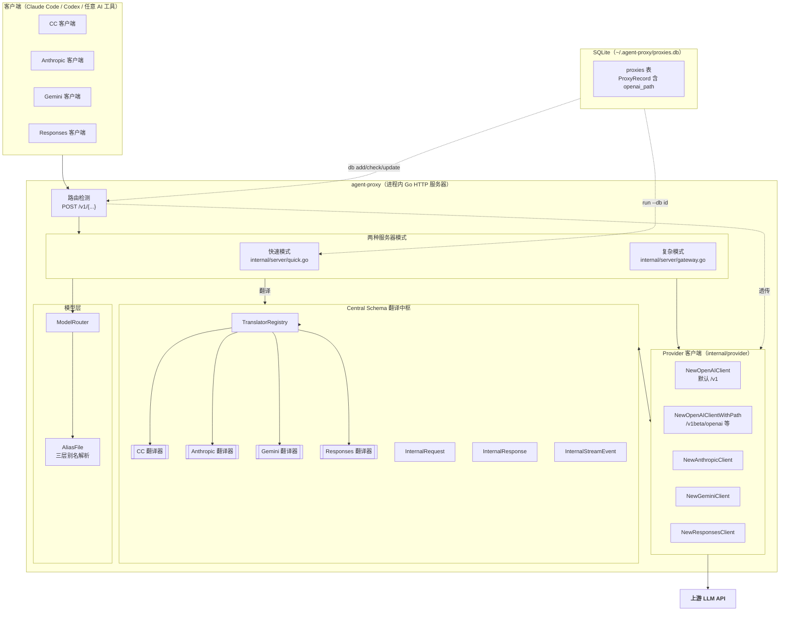
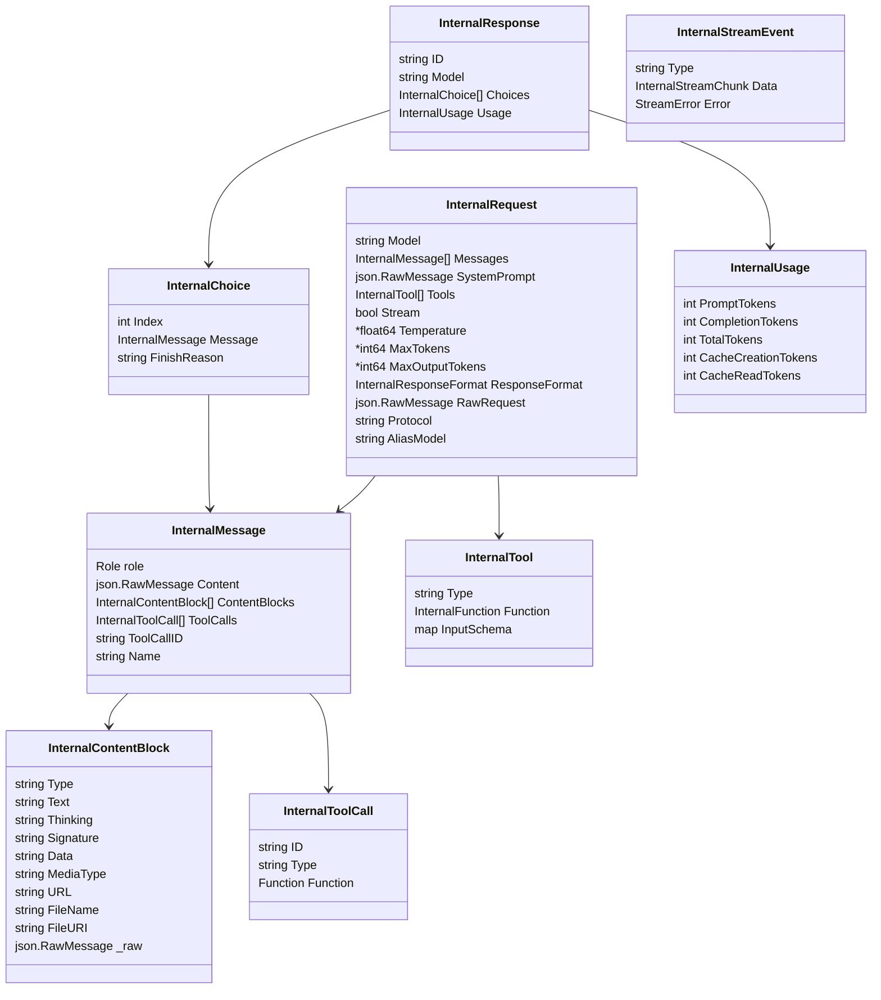
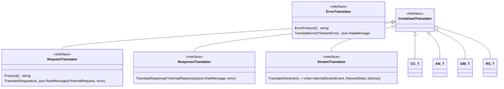
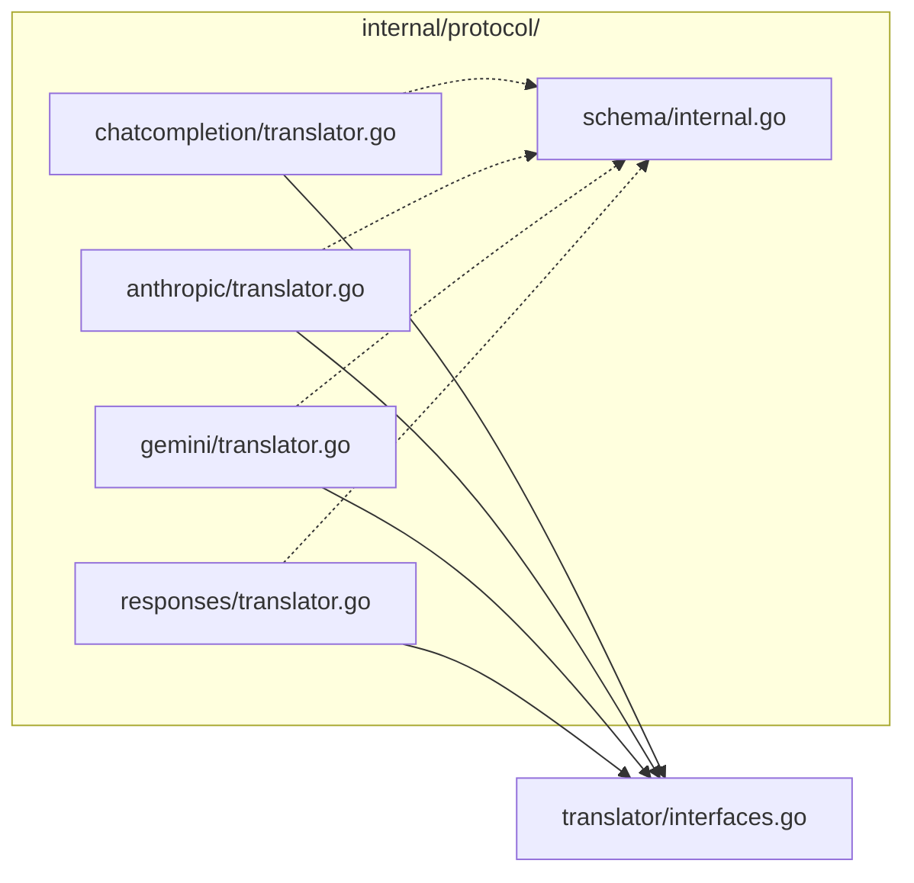
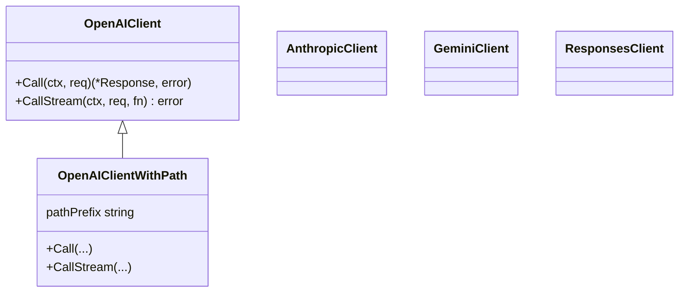
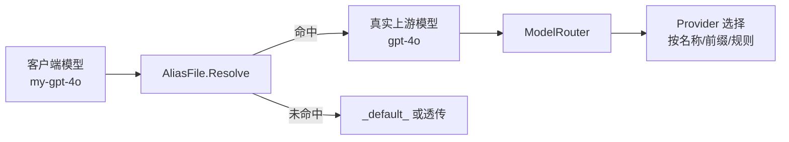
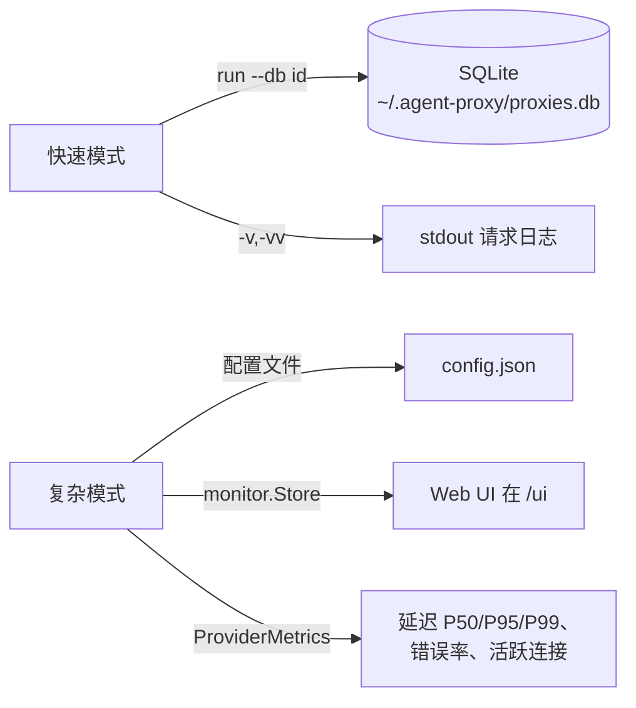

# Agent-Proxy — 系统架构

> 一个 4×4 AI 协议网关，纯 Go 编写、内嵌 SQLite。
> 它在四种 LLM API（OpenAI ChatCompletion、Anthropic Messages、Google Gemini、OpenAI Responses）之间做透明翻译，让客户端无感知。
>
> 本文档讲**有哪些东西、放在哪**。
> 单点深挖见同级文档：
> - [`REQUEST_LIFECYCLE.md`](REQUEST_LIFECYCLE.md) — 请求流水线、路由、SSE
> - [`OPENAIPATH_CHAIN.md`](OPENAIPATH_CHAIN.md) — Google Gemini OpenAIPath 传递
> - [`PROTOCOL_COMPARISON.md`](PROTOCOL_COMPARISON.md) — 各协议字段 / 事件差异
> - [`DESIGN.md`](DESIGN.md) — 完整设计历史与扩展机制说明

---

## 1. 全景架构

**贯穿一切的唯一硬规则**：没有协议直接翻译成另一个协议。每一次转换都走 **入站协议 → InternalRequest → Provider 协议**（响应方向反过来），每次都经过 Central Schema。

---

## 2. 两种服务器模式

代理提供两种模式，共享同一层协议和翻译逻辑。

| | **快速模式**（`--db <id>`） | **复杂模式**（`--mode complex` / 配置文件） |
|---|---|---|
| 入口 | `main.go:startQuickMode` | `main.go:startComplexMode` |
| Handler | `internal/server/quick.go`（`QuickGateway`） | `internal/server/gateway.go`（`Gateway`） |
| 配置来源 | SQLite 里的一条 `ProxyRecord` | `config.ProviderConfig` map（JSON/YAML） |
| Provider 来源 | `DB record → NewQuickGateway(...)` | `config.json → NewGateway(cfg)` |
| 别名 | `AliasFile`（三层） | 同 `AliasFile` 机制 |
| 鉴权 | 每代理独立 key（随机或 `--key`） | 全局 `config.Auth.APIKey` |
| 可观测 | `-v` / `-vv` 请求日志 | `monitor.Store` + `/ui` Web UI + 指标 |
| OpenAIPath | `record.OpenAIPath → q.openAIPath` | `pc.OpenAIPath`（配置字段） |

两种模式**必须保持同步** —— 对一个 handler（`handleStreamRequest`、`handlePassthroughStream`、`handlePassthroughNonStream`）的修复要镜像到另一个。看 `CLAUDE.md` 里的 `@AI_GUARD` 标记和同步检查清单。

---

## 3. Central Schema（`internal/protocol/schema/internal.go`）

翻译引擎的心脏。四种协议全部归一化到这些类型：

**设计不变量**（由 `@AI_GUARD` 标记强制执行）：

1. **Content 是 `json.RawMessage`** —— 不是具体类型。CC 的 content 可以是 `string | ContentBlock[]`，Anthropic/Responses 是 `ContentBlock[]`，Gemini 是 `Part[]`。在 schema 里保留 raw，避免意外丢失信息。
2. **System prompt 单独抽出**到自己的字段。每个协议放的位置不同（CC `messages[0]`、Anthropic 顶层 `system`、Responses 顶层 `instructions`、Gemini `systemInstruction`）。schema 的 `Messages` 里绝不携带 system。
3. **Tool 参数保留无损**：CC 把 `arguments` 存为 JSON 字符串，其他协议存为对象。`InternalToolCall.Function` 同时持有 `Arguments`（string）和 `RawArguments`（`json.RawMessage`），两个方向都能无重复序列化重建。
4. **`RawExtension` / `_raw`** 兜底协议专属字段，避免静默丢失。

---

## 4. 翻译器合约（`internal/translator/interfaces.go`）

每个协议都实现 `CombinedTranslator`：

关键签名：

- `TranslateRequest(ctx, rawReq json.RawMessage) → (*InternalRequest, error)` —— 入站协议 → Central Schema。
- `TranslateResponse(*InternalResponse) → (json.RawMessage, error)` —— Central Schema → 入站协议（非流）。
- `TranslateStream(ctx, <-chan InternalStreamEvent, fn(eventData, isDone))` —— Central Schema 事件 → 协议 SSE 到线路上。
- `TranslateStreamEvent(json.RawMessage) → InternalStreamEvent` —— 上游 SSE → Central Schema（流式摄入）。签名**必须**接受 `json.RawMessage` —— 历史上签名不一致在 Responses 翻译器里产生过死代码（`@REASON` 见 `interfaces.go`）。

注册表（`TranslatorRegistry`）以 `Protocol()` 为键（`"chatcompletion" | "anthropic" | "gemini" | "responses"`）。

---

## 5. 协议目录结构

每个 `translator.go` 都实现完整的 `CombinedTranslator` 集（request、response、stream、stream-event、error）。还各带 `multimodal_test.go` 和 `response_roundtrip_test.go`，验证 translate-out → translate-back 无损。

---

## 6. Provider 客户端（`internal/provider/openai.go` 及同族）

真正与上游 API 对话的 HTTP 层：

- **`NewOpenAIClient(name, baseURL, timeout)`** —— 默认，假设 `/v1` 前缀。向后兼容，除自定义前缀外到处用。
- **`NewOpenAIClientWithPath(name, baseURL, timeout, pathPrefix)`** —— 接受自定义前缀（如 Google Gemini 的 `"/v1beta/openai"`）。空串回退到 `"/v1"`。快速模式（`q.openAIPath`）和复杂模式（`pc.OpenAIPath`）都用它。
- **`GeminiClient` / `AnthropicClient` / `ResponsesClient`** —— 不变；各自处理自己的端点形态。

每个 client 都暴露 `Call`（非流）和 `CallStream`（SSE），server 层就靠这两个钩子。

---

## 7. 模型别名与路由层

模型解析分两阶段：

**AliasFile**（`internal/db/aliasfile.go`）—— 三层加载顺序，由 `@AI_GUARD ALIAS_LOAD_AUTO` 强制：

1. `--aliases <file>`（CLI 覆盖，最高优先级）
2. `model-aliases.yaml`（从工作目录 / 家目录自动加载）
3. `DefaultAliases()`（内置兜底，最低）

解析规则（`@AI_GUARD ALIAS_RESOLVE`）：

- 查别名。若目标等于别名本身（无真实映射）且存在 `_default_`，用 `_default_`。
- `@default` 动态取上游第一个模型。
- **双向**：请求侧解析假名 → 真名；响应侧解析真名 → 假名，让客户端永远看到自己发的名字。

**ModelRouter**（`internal/router/router.go`）—— 按显式映射、前缀匹配或默认 provider 把真实模型名路由到 provider。

---

## 8. 可观测与存储

- **SQLite 结构**：`proxies` 表含 `provider_type`、`capabilities_json`、`models_map_json`、`upstream_type`、`openai_path`、`weight`、`created_at` 等列。`capabilities_json`、`models_map_json`、`upstream_type`、`openai_path` 由 `Init()` 时 `ALTER TABLE` 按需补列 —— 结构迁移向后兼容。
- **快速模式**：无配置文件、无 Web UI —— 一条 DB 记录驱动一切。
- **复杂模式**：完整配置、monitor store、`/status`、`/ui`、限流器。

---

## 9. 错误与兼容合约

整个栈要防的两个兼容问题：

1. **Usage 字段** —— Claude Code 客户端校验 `usage.input_tokens` / `usage.output_tokens`。任何 null / 缺失的 usage 由 `quick.go:fixNullUsageInResponse` 修补（翻译层保证 `InternalUsage` 非空）。
2. **SSE 生命周期** —— 每个协议有严格的事件序列（Anthropic：`message_start → ... → message_stop`；Responses：`response.created → ... → response.completed`）。翻译器即使通道提前关闭也发出完整序列，靠状态标记（`blockStarted`、`createdSent`、`itemAdded`）保证。

完整的请求流与 SSE 细节见 [`REQUEST_LIFECYCLE.md`](REQUEST_LIFECYCLE.md)。
