# Agent-Proxy 设计文档

> 底层机制、协议处理流程、消息转换详解。面向开发者与 AI 辅助开发。
>
> 用户操作指南见 [MANUAL.md](../MANUAL.md)。

***

## 架构概览

### Central Schema（翻译中枢）

所有外部协议先转为 `schema.InternalRequest`（统一中枢结构），再转为下游格式。这保证 N 个协议只需 N 个翻译器，而非 N×N。

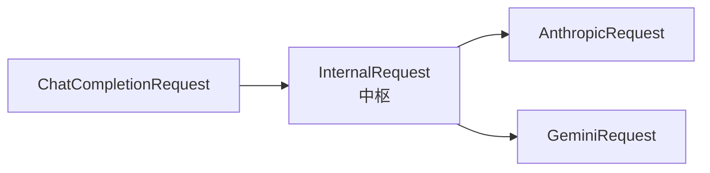
```mermaid
flowchart LR
    CC[ChatCompletionRequest] --> IR[InternalRequest<br/>中枢]
    IR --> A[AnthropicRequest]
    IR --> G[GeminiRequest]
```

**架构原则：禁止协议 A 直接翻译到协议 B；必须协议 A → Schema → 协议 B。**

### 处理流水线：消息格式 vs 流/非流

翻译路径的完整处理顺序：**消息格式转换先行，流/非流决策后置**。

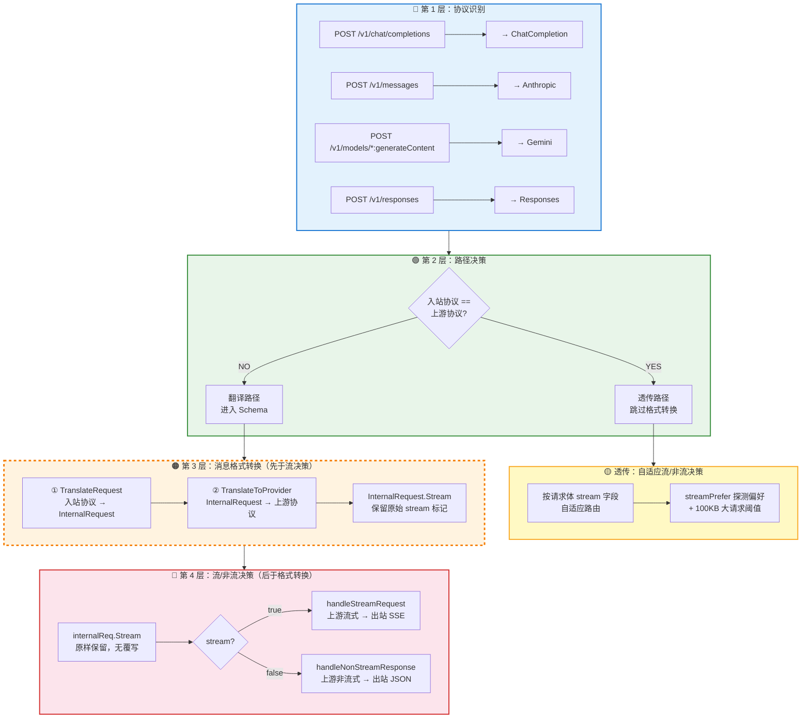
```mermaid
flowchart TD
    subgraph L1["🔵 第 1 层：协议识别"]
        direction LR
        A1["POST /v1/chat/completions"] --> A2["→ ChatCompletion"]
        A3["POST /v1/messages"] --> A4["→ Anthropic"]
        A5["POST /v1/models/*:generateContent"] --> A6["→ Gemini"]
        A7["POST /v1/responses"] --> A8["→ Responses"]
    end

    L1 --> L2

    subgraph L2["🟢 第 2 层：路径决策"]
        direction LR
        B1{"入站协议 ==<br/>上游协议?"}
        B1 -->|YES| B2["透传路径<br/>跳过格式转换"]
        B1 -->|NO| B3["翻译路径<br/>进入 Schema"]
    end

    B2 --> L2B

    subgraph L2B["🟡 透传：自适应流/非流决策"]
        direction LR
        C1["按请求体 stream 字段<br/>自适应路由"] --> C2["streamPrefer 探测偏好<br/>+ 100KB 大请求阈值"]
    end

    B3 --> L3

    subgraph L3["🟠 第 3 层：消息格式转换（先于流决策）"]
        direction LR
        D1["① TranslateRequest<br/>入站协议 → InternalRequest"] --> D2["② TranslateToProvider<br/>InternalRequest → 上游协议"]
        D2 --> D3["InternalRequest.Stream<br/>保留原始 stream 标记"]
    end

    L3 --> L4

    subgraph L4["🔴 第 4 层：流/非流决策（后于格式转换）"]
        direction LR
        E1["internalReq.Stream<br/>原样保留，无覆写"] --> E2{"stream?"}
        E2 -->|true| E3["handleStreamRequest<br/>上游流式 → 出站 SSE"]
        E2 -->|false| E4["handleNonStreamResponse<br/>上游非流式 → 出站 JSON"]
    end

    style L1 fill:#e3f2fd,stroke:#1976d2,stroke-width:2px
    style L2 fill:#e8f5e9,stroke:#388e3c,stroke-width:2px
    style L2B fill:#fff9c4,stroke:#f9a825,stroke-width:2px
    style L3 fill:#fff3e0,stroke:#f57c00,stroke-width:3px,stroke-dasharray:5 5
    style L4 fill:#fce4ec,stroke:#d32f2f,stroke-width:2px
```

> **关键结论：消息格式转换（第 3 层）在流/非流决策（第 4 层）之前。**
> `InternalRequest.Stream` 字段担任"信使"——在 TranslateRequest 阶段从入站协议提取并保留，原样传递到第 4 层决定路由。翻译路径不覆写该字段，客户端的 `stream` 取值直通上游。

### 两大路径：透传 vs 翻译

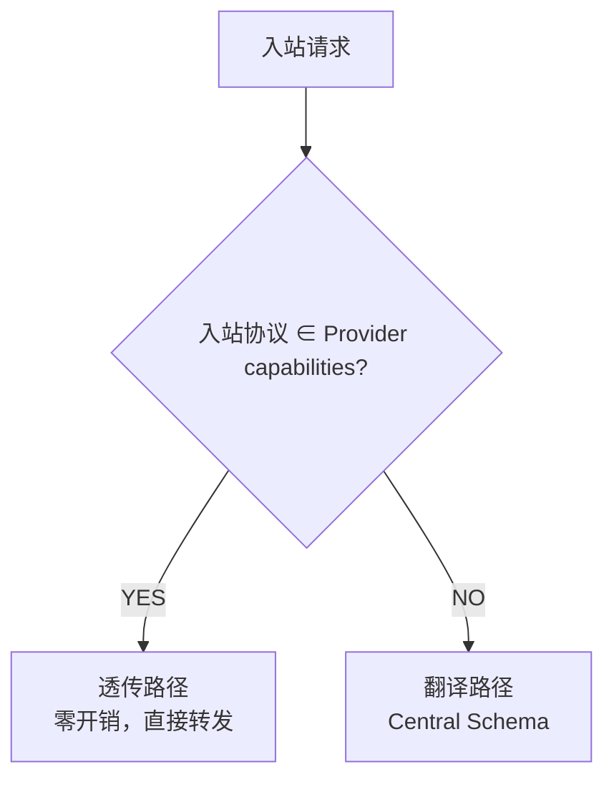
```mermaid
flowchart TD
    A[入站请求] --> B{入站协议 ∈ Provider capabilities?}
    B -->|YES| C[透传路径<br/>零开销，直接转发]
    B -->|NO| D[翻译路径<br/>Central Schema]
```

| 路径 | 触发条件         | 请求处理                                                     | 响应处理                                                         | 损耗             |
| -- | ------------ | -------------------------------------------------------- | ------------------------------------------------------------ | -------------- |
| 透传 | 入站协议 == 上游协议 | 原样转发，仅替换 model 名                                         | 原样回传（或 SSE 包装）                                               | 零              |
| 翻译 | 入站协议 != 上游协议 | TranslateRequest → InternalRequest → TranslateToProvider | TranslateFromProvider → InternalResponse → TranslateResponse | 两次 JSON 解析/序列化 |

***

## 入站/出站协议处理全流程

### 路由决策树

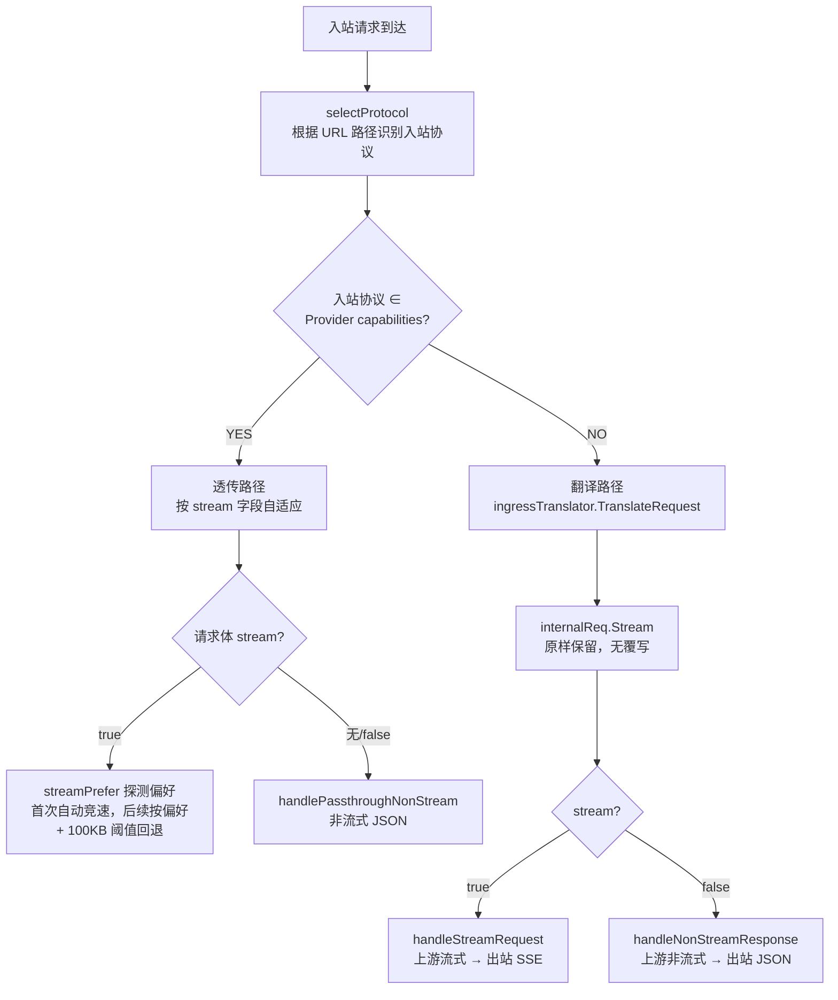
```mermaid
flowchart TD
    A[入站请求到达] --> B[selectProtocol<br/>根据 URL 路径识别入站协议]
    B --> C{入站协议 ∈<br/>Provider capabilities?}
    C -->|YES| D[透传路径<br/>按 stream 字段自适应]
    C -->|NO| E[翻译路径<br/>ingressTranslator.TranslateRequest]
    D --> D1{请求体 stream?}
    D1 -->|true| D2[streamPrefer 探测偏好<br/>首次自动竞速，后续按偏好<br/>+ 100KB 阈值回退]
    D1 -->|无/false| D3[handlePassthroughNonStream<br/>非流式 JSON]
    E --> G[internalReq.Stream<br/>原样保留，无覆写]
    G --> H{stream?}
    H -->|true| I[handleStreamRequest<br/>上游流式 → 出站 SSE]
    H -->|false| J[handleNonStreamResponse<br/>上游非流式 → 出站 JSON]
```

### 透传路径分支标注（按请求体 `stream` 字段自适应）

`--stream-mode` 自 v0.2.60 起已移除，透传路径不再有模式参数，改由请求体 `stream` 字段直接决定：

| 请求体 `stream` 字段 | 上游请求 | 上游响应 → 客户端 | 处理函数 |
| ------------------ | ------- | ---------------- | ------- |
| `stream: true`（首次，未探测） | 非流式 | JSON 拆解为 SSE 事件流 | `handlePassthroughNonStreamAsSSE` |
| `stream: true`（偏好非流式更快） | 非流式 | JSON 拆解为 SSE 事件流 | `handlePassthroughNonStreamAsSSE` |
| `stream: true`（偏好 SSE 更快，body ≤ 100KB） | 流式 | 原样透传 SSE | `handlePassthroughStream` |
| `stream: true`（body > 100KB） | 非流式 | JSON 拆解为 SSE 事件流 | `handlePassthroughNonStreamAsSSE` |
| 无 `stream` 字段 / `stream: false` | 非流式 | 原样透传 JSON（chunked transfer） | `handlePassthroughNonStream` |

> `stream: true` 时**不会**向上游注入 `stream:true`——首次请求按非流式发出，仅在探测确认 SSE 更快且请求体小于 100KB 后才走原生流式。100KB 阈值为 `LARGE_BODY_SKIP_STREAM` 约束：大请求流式处理在 SenseNova 等上游会失败，客户端等不到结果即断开。

**分支使用的消息转换：**

| 分支函数                              | 入站→上游                  | 上游→出站           | 转换说明                                                  |
| --------------------------------- | ---------------------- | --------------- | ----------------------------------------------------- |
| `handlePassthroughStream`         | 无转换（body 原样，仅替换 model） | 无转换（原样透传 SSE）   | 统一 `data:` 前缀，500ms 心跳                              |
| `handlePassthroughNonStream`      | 无转换（仅替换 model 名）       | 无转换（原样透传 JSON）  | chunked transfer 防超时                                  |
| `handlePassthroughNonStreamAsSSE` | 无转换（仅替换 model 名）       | **JSON→SSE 拆解** | 上游非流式 JSON → Anthropic/OpenAI/Gemini/Responses SSE 事件 |

### 翻译路径分支标注（按 `internalReq.Stream` 原样路由）

翻译路径**不做任何覆写**：客户端 `stream: true` 就走上游流式，否则走上游非流式。客户端与上游的流式取值始终一致。

| 入站 `stream` | 上游 `stream` | 处理函数                 | 说明                        |
| ----------- | ----------- | -------------------- | ------------------------- |
| true        | true        | `handleStreamRequest`   | 入站流式 → 上游流式 → 出站 SSE          |
| false       | false       | `handleNonStreamResponse` | 入站非流式 → 上游非流式 → 出站 JSON       |

**翻译管道核心流程：**

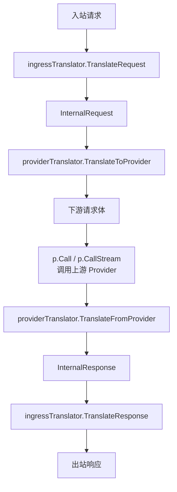
```mermaid
flowchart TD
    A[入站请求] --> B[ingressTranslator.TranslateRequest]
    B --> C[InternalRequest]
    C --> D[providerTranslator.TranslateToProvider]
    D --> E[下游请求体]
    E --> F[p.Call / p.CallStream<br/>调用上游 Provider]
    F --> G[providerTranslator.TranslateFromProvider]
    G --> H[InternalResponse]
    H --> I[ingressTranslator.TranslateResponse]
    I --> J[出站响应]
```

**流式翻译链路：**

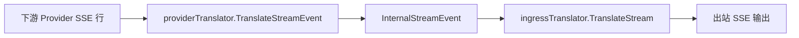
```mermaid
flowchart LR
    A[下游 Provider SSE 行] --> B[providerTranslator.TranslateStreamEvent]
    B --> C[InternalStreamEvent]
    C --> D[ingressTranslator.TranslateStream]
    D --> E[出站 SSE 输出]
```

**使用的翻译器：**

| 翻译器                        | 文件                                               | 负责协议                  |
| -------------------------- | ------------------------------------------------ | --------------------- |
| `ChatCompletionTranslator` | `internal/protocol/chatcompletion/translator.go` | OpenAI ChatCompletion |
| `AnthropicTranslator`      | `internal/protocol/anthropic/translator.go`      | Anthropic Messages    |
| `GeminiTranslator`         | `internal/protocol/gemini/translator.go`         | Google Gemini         |
| `ResponsesTranslator`      | `internal/protocol/responses/translator.go`      | OpenAI Responses      |

***

## 透传路径底层机制

### 自适应流式策略（原 `auto`，现为唯一行为）

`--stream-mode` 自 v0.2.60 起已移除。原 `auto` 模式的自适应探测逻辑成为透传路径 `stream: true` 请求的唯一行为，不再有 `stream` / `non-stream` / `passthrough` 三种可选模式。

首次 `stream: true` 请求走非流式上游 + SSE 包装，响应后启动后台 goroutine 探测同上游的 SSE 流式速度；后续请求按探测结果选择。

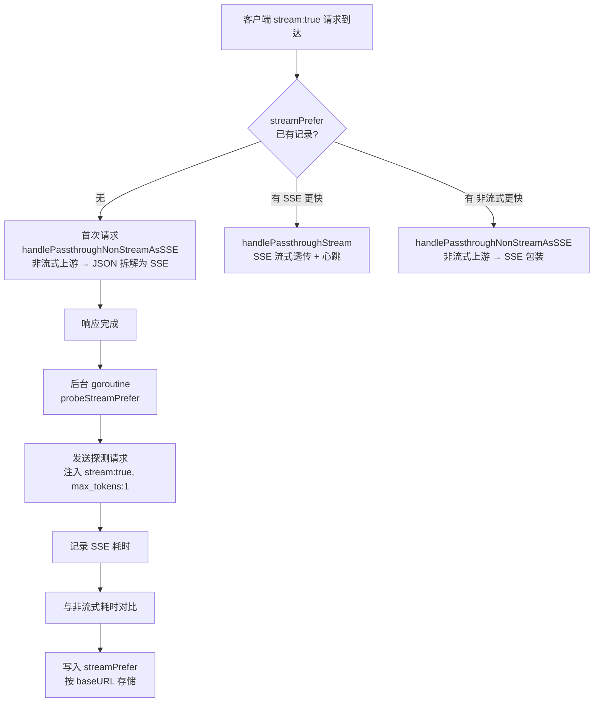
```mermaid
flowchart TD
    A[客户端 stream:true 请求到达] --> B{streamPrefer<br/>已有记录?}
    B -->|无| C[首次请求<br/>handlePassthroughNonStreamAsSSE<br/>非流式上游 → JSON 拆解为 SSE]
    B -->|有 SSE 更快| D[handlePassthroughStream<br/>SSE 流式透传 + 心跳]
    B -->|有 非流式更快| E[handlePassthroughNonStreamAsSSE<br/>非流式上游 → SSE 包装]
    C --> F[响应完成]
    F --> G[后台 goroutine<br/>probeStreamPrefer]
    G --> H[发送探测请求<br/>注入 stream:true, max_tokens:1]
    H --> I[记录 SSE 耗时]
    I --> J[与非流式耗时对比]
    J --> K[写入 streamPrefer<br/>按 baseURL 存储]
```

偏好按上游地址独立存储 (`streamPrefer map[string]bool`)，多上游互不干扰。探测失败（SSE 不支持）时保留默认偏好（非流式）。

### chunked JSON 防超时机制

`handlePassthroughNonStream` 在调用上游之前先写 `Content-Type: application/json` + `200 OK` + `Flush()`，Go 的 `net/http` 自动使用 `Transfer-Encoding: chunked`。客户端立即收到响应头，知道 body 还在后面，在上游等待期间不会误判连接已死（ECONNRESET）。

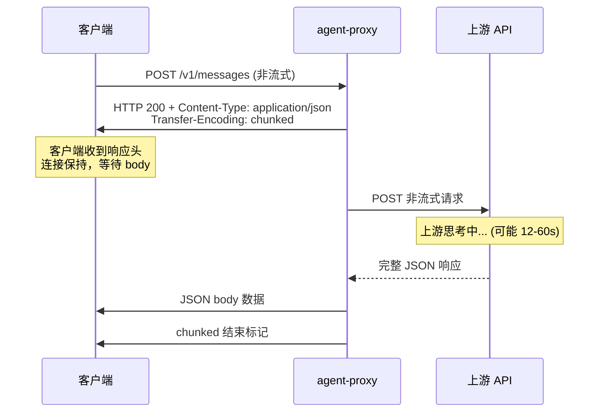
```mermaid
sequenceDiagram
    participant C as 客户端
    participant P as agent-proxy
    participant U as 上游 API

    C->>P: POST /v1/messages (非流式)
    P->>C: HTTP 200 + Content-Type: application/json<br/>Transfer-Encoding: chunked
    Note over C: 客户端收到响应头<br/>连接保持，等待 body
    P->>U: POST 非流式请求
    Note over U: 上游思考中... (可能 12-60s)
    U-->>P: 完整 JSON 响应
    P->>C: JSON body 数据
    P->>C: chunked 结束标记
```

### 心跳机制

`stream` 和 `auto`（流式偏好）路径中，每 500ms 发送 `event: ping\ndata: {"type":"ping"}\n\n` 心跳（标准 Anthropic ping 事件），防止上游思考（cogitation）期间客户端超时断开。

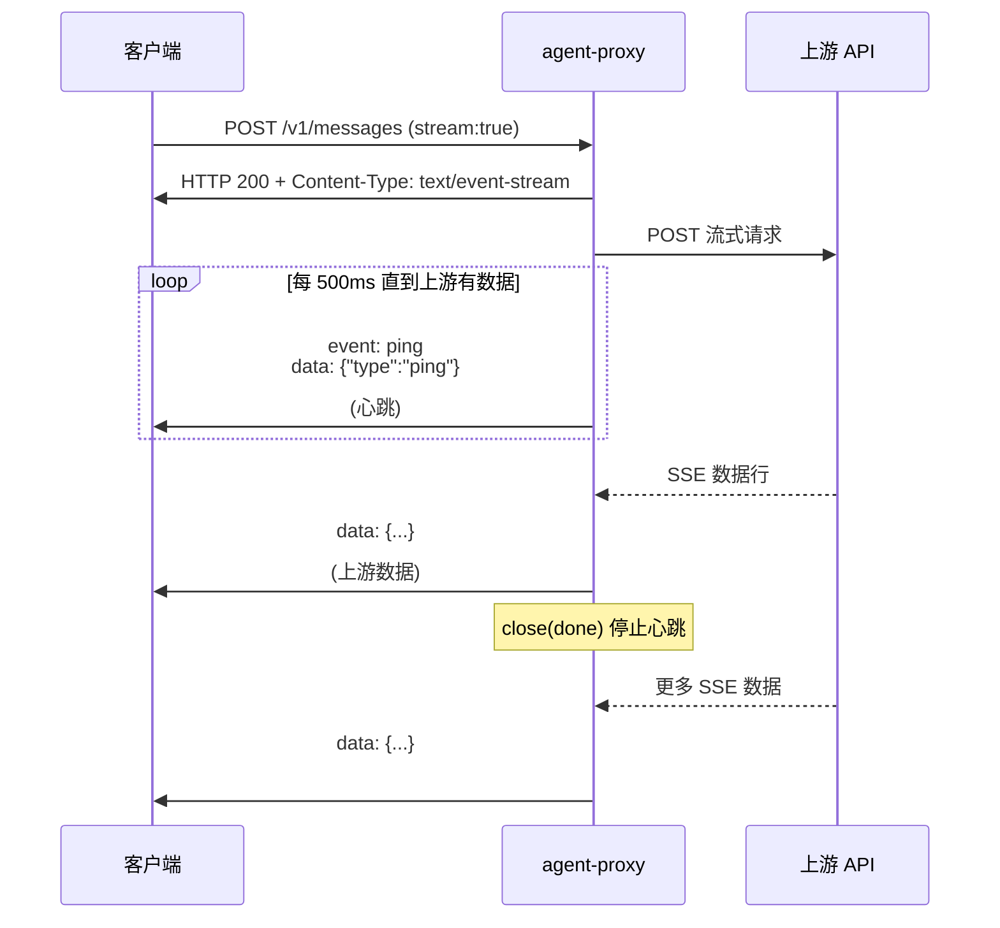
```mermaid
sequenceDiagram
    participant C as 客户端
    participant P as agent-proxy
    participant U as 上游 API

    C->>P: POST /v1/messages (stream:true)
    P->>C: HTTP 200 + Content-Type: text/event-stream
    P->>U: POST 流式请求
    loop 每 500ms 直到上游有数据
        P->>C: event: ping<br/>data: {"type":"ping"}<br/><br/>(心跳)
    end
    U-->>P: SSE 数据行
    P->>C: data: {...}<br/><br/>(上游数据)
    Note over P: close(done) 停止心跳
    U-->>P: 更多 SSE 数据
    P->>C: data: {...}<br/><br/>
```

**心跳格式演进（血泪教训，不可回退）：**

| 格式 | 问题 | 状态 |
| --- | --- | --- |
| `data: \n\n` | Kimi 等严格客户端空 data 行 `JSON.parse("")` 报错 | ❌ 已废弃 |
| `data: {}\n\n` | Claude Code 解析为 Anthropic 事件，缺少 `type` 字段 → 解析失败 | ❌ 已废弃 |
| `: heartbeat\n\n` | SSE 注释，Claude Code 不识别为"内容活动"，不重置 HTTP 超时 → 长上游响应时客户端断开 | ❌ 已废弃 |
| `data: {"type":"ping"}\n\n` | 缺少 `event:` 前缀，Claude Code 不识别为 ping 事件，不重置超时 → 仍报 empty response | ❌ 已废弃 |
| `event: ping\ndata: {"type":"ping"}\n\n` | 完整 Anthropic SSE 格式，Claude Code 正确识别并重置超时 | ✅ 当前使用 |

心跳仅在等待上游响应期间发送，响应到达后立即 `close(done)` 停止。详见 [quick.go](file:///f:/src/agent-proxy/internal/server/quick.go#L56-L66) 的 `heartbeatEvent` 变量与 `@AI_GUARD: SSE_HEARTBEAT_FORMAT` 标记。

### SSE 透传 `data:` 前缀规范化

透传路径对 Provider 输出行进行 `data:` 前缀规范化：`OpenAIClient` 输出纯 JSON 行（缺 `data:` 前缀），`AnthropicClient` 输出带 `data:` 前缀的行。透传写出时统一检测并补全 `data:` 前缀，确保所有 SSE 行符合 `data: <json>\n\n` 标准格式。

### Anthropic SSE 事件合规性

`NonStreamAsSSE` 与 `TranslateStream` 生成的 Anthropic 流式事件严格遵循 [Anthropic Messages API 规范](https://docs.anthropic.com/en/api/messages-streaming)：

| 事件                    | 关键字段                                                   | 合规要点                                                                                                  |
| --------------------- | ------------------------------------------------------ | ----------------------------------------------------------------------------------------------------- |
| `message_start`       | `message.type`, `message.id`, `message.stop_reason`, `message.usage` | `type` 必填 `"message"`；`id` 必填 `msg_<timestamp>`（不可为空，否则 Claude Code 报 empty/malformed response）；`stop_reason` 初始为 `null`；`usage` 为 `{input_tokens:0, output_tokens:0}` 对象（非 null，`output_tokens` 必须为 `0` 不可为 `1`） |
| `content_block_start` | `content_block.citations`                              | `text` 类型必须包含 `citations: []`（不可省略，否则 Kimi 解析失败）；必须在第一个 `content_block_delta` 之前发送           |
| `content_block_delta` | `delta.type`, `delta.text`                             | `text_delta` / `thinking_delta` / `input_json_delta` 区分                                              |
| `content_block_stop`  | `index`                                                | 必须在 `message_delta` 之前发送；`ctx.Done()` 时也必须发送                                                          |
| `message_delta`       | `delta.stop_reason`, `delta.stop_sequence`, `usage`    | `stop_sequence` 必填（`null`）；**必须始终发送**，即使 `usage` 为 `nil` 也需带默认 `output_tokens:0`（Claude Code 校验 `K.usage.input_tokens`） |
| `message_stop`        | `type`                                                 | `{"type":"message_stop"}`                                                                             |
| `error`               | `type`, `error.type`, `error.message`                  | 标准 `event: error\ndata: {"type":"error","error":{"type":"...","message":"..."}}\n\n`                 |

**完整事件序列（缺一不可）：**

```
message_start → content_block_start → content_block_delta* → content_block_stop → message_delta → message_stop
```

详见 [anthropic/translator.go](file:///f:/src/agent-proxy/internal/protocol/anthropic/translator.go#L370-L391) 的 `@AI_GUARD: ANTHROPIC_TRANSLATE_STREAM` 标记。

### `NonStreamAsSSE` 响应格式检测

`writeNonStreamAsSSE` 解析上游完整 JSON，按字段检测格式并生成对应的 SSE 事件：

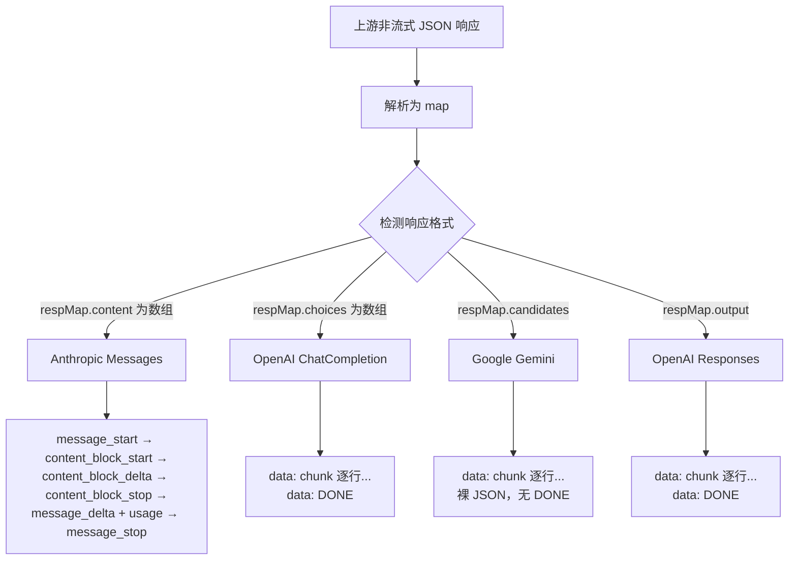
```mermaid
flowchart TD
    A[上游非流式 JSON 响应] --> B[解析为 map]
    B --> C{检测响应格式}
    C -->|"respMap.content 为数组"| D[Anthropic Messages]
    C -->|"respMap.choices 为数组"| E[OpenAI ChatCompletion]
    C -->|"respMap.candidates"| F[Google Gemini]
    C -->|"respMap.output"| G[OpenAI Responses]
    D --> D1["message_start → content_block_start →<br/>content_block_delta → content_block_stop →<br/>message_delta + usage → message_stop"]
    E --> E1["data: chunk 逐行...<br/>data: DONE"]
    F --> F1["data: chunk 逐行...<br/>裸 JSON，无 DONE"]
    G --> G1["data: chunk 逐行...<br/>data: DONE"]
```

| 检测字段                     | 协议                    | 生成的 SSE 事件                                                                                                                         |
| ------------------------ | --------------------- | ---------------------------------------------------------------------------------------------------------------------------------- |
| `respMap["content"]` 为数组 | Anthropic Messages    | `message_start` → `content_block_start` → `content_block_delta` → `content_block_stop` → `message_delta`(含 usage) → `message_stop` |
| `respMap["choices"]` 为数组 | OpenAI ChatCompletion | `data: {chunk}...\n\ndata: [DONE]\n\n`                                                                                             |
| `respMap["candidates"]`  | Gemini                | `data: {chunk}...\n\n`（裸 JSON，无 \[DONE]）                                                                                           |
| `respMap["output"]`      | OpenAI Responses      | `data: {chunk}...\n\ndata: [DONE]\n\n`                                                                                             |

***

## 翻译路径底层机制

### 8 大协议差异点处理

| # | 差异点           | CC 入口                         | Anthropic 输出                             | Gemini 输出                                   |
| - | ------------- | ----------------------------- | ---------------------------------------- | ------------------------------------------- |
| 1 | System prompt | 提取到 `internalReq.System`      | 顶层 `system` 字段                           | `systemInstruction`                         |
| 2 | Tool 定义       | `tools[].function.parameters` | `tools[].input_schema`                   | `tools[].functionDeclarations[].parameters` |
| 3 | Tool call     | `tool_calls[]` 独立字段           | `content[]` 混入 `type: "tool_use"`        | `parts[]` 混入 `functionCall`                 |
| 4 | Tool args     | `arguments` JSON 字符串          | `input` JSON 对象                          | `args` JSON 对象                              |
| 5 | Tool result   | `role: "tool"`                | `role: "user"` + `tool_use_id`           | `role: "user"` + `functionResponse`         |
| 6 | Usage         | `prompt_tokens`               | `input_tokens` → 映射回                     | `prompt_token_count` → 映射回                  |
| 7 | Stop reason   | `stop` / `length`             | `end_turn`→`stop`; `max_tokens`→`length` | 同左                                          |
| 8 | SSE 流式        | 纯 data 行，无 event              | `type` 字段区分 chunk                        | 标准 SSE                                      |

### InternalMessage 结构

```go
type InternalMessage struct {
    Role      MessageRole          `json:"role"`
    Content   json.RawMessage      `json:"content"`    // 保留原始结构，避免信息丢失
    ToolCalls []InternalToolCall   `json:"tool_calls,omitempty"`
    ToolCallID string              `json:"tool_call_id,omitempty"`
    Name      string               `json:"name,omitempty"`
}
```

### 流式翻译详解

翻译路径的流式处理以 **两层转换** 为核心：上游 SSE → 统一内部事件 → 入站协议 SSE。

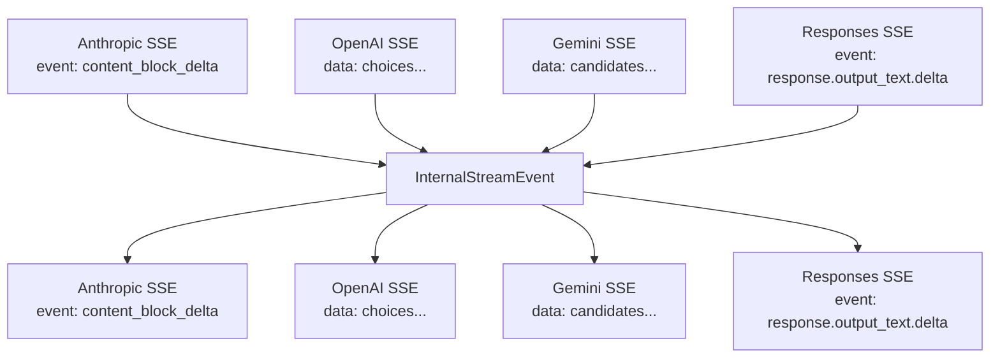
```mermaid
flowchart TD
    A1["Anthropic SSE<br/>event: content_block_delta"] --> IE[InternalStreamEvent]
    A2["OpenAI SSE<br/>data: choices..."] --> IE
    A3["Gemini SSE<br/>data: candidates..."] --> IE
    A4["Responses SSE<br/>event: response.output_text.delta"] --> IE
    IE --> B1["Anthropic SSE<br/>event: content_block_delta"]
    IE --> B2["OpenAI SSE<br/>data: choices..."]
    IE --> B3["Gemini SSE<br/>data: candidates..."]
    IE --> B4["Responses SSE<br/>event: response.output_text.delta"]
```

> 左侧 4 种上游协议 SSE 经 `providerTranslator.TranslateStreamEvent()` 转为 `InternalStreamEvent`，再经 `ingressTranslator.TranslateStream()` 转回入站协议 SSE 输出。

各协议翻译器的流式转换实现：

| 协议             | TranslateStreamEvent（上游→内部）                                                       | TranslateStream（内部→出站）                                 |
| -------------- | --------------------------------------------------------------------------------- | ------------------------------------------------------ |
| Anthropic      | `content_block_delta` / `message_start` / `message_delta` → `InternalStreamEvent` | `InternalStreamEvent` → 完整事件序列：`message_start` → `content_block_start` → `content_block_delta` → `content_block_stop` → `message_delta` → `message_stop` |
| ChatCompletion | CC delta chunk → `InternalStreamEvent`                                            | 直接透传 `data: {...}`                                     |
| Gemini         | Gemini chunk → `InternalStreamEvent`                                              | `InternalStreamEvent` → Gemini SSE                     |
| Responses      | Responses event → `InternalStreamEvent`                                           | `InternalStreamEvent` → Responses SSE（完整事件序列见下表）       |

> **Anthropic 输出路径 SSE 事件生命周期约束**：`TranslateStream` 通过 `blockStarted` 状态标记确保严格遵守 Anthropic 规范的完整事件序列。`message_start` 的 `message.content` 初始化为 `[]`（非 `null`），`content_block_start` 包含 `citations: []`，`content_block_stop` 在 `message_delta` 之前发送，`ctx.Done()` 时也安全关闭。详见 [AGENTS.md](../AGENTS.md) 的 Anthropic SSE 事件生命周期章节。

> **Responses 输出路径 SSE 事件生命周期约束（Codex 兼容）**：`TranslateStream` 必须生成完整事件序列，Codex 严格校验每个事件的字段名与结构：
>
> ```
> response.created → response.output_item.added → response.output_text.delta* → response.output_item.done → response.completed
> ```
>
> 关键约束：
> - `response.created` / `response.completed` 事件数据必须用 `response` 字段（非 `data`）
> - `response.completed` 的 `response.output[]` 必须包含累积的完整内容
> - channel 关闭或 `ctx.Done()` 时必须补发完整结束序列再发 `[DONE]`
> - 不可只发 `[DONE]`（Codex 报 `stream closed before response.completed`）
>
> 详见 [responses/translator.go](file:///f:/src/agent-proxy/internal/protocol/responses/translator.go#L350-L363) 的 `@AI_GUARD: RESPONSES_TRANSLATE_STREAM` 标记。

各协议 SSE 格式差异：

| 协议          | SSE 格式                                                                   |
| ----------- | ------------------------------------------------------------------------ |
| CC / OpenAI | 纯 `data: {...}\n\n`，无 event 行，以 `data: [DONE]` 结尾                        |
| Anthropic   | 每行带 `type` 字段（`message_start` / `content_block_delta` / `message_delta`） |
| Gemini      | 每行是完整 `StreamChunk` 对象，带 `candidates` 数组                                 |
| Responses   | 带 named events（`event: response.created` / `response.output_text.delta` / `response.completed` 等），以 `data: [DONE]` 结尾 |

#### 场景 A：入站流式 → 上游流式 → 出站 SSE（`handleStreamRequest`）

翻译路径的标准流式处理，客户端发流式请求，上游也走流式，实时透出 SSE 事件。

**架构：goroutine + channel 解耦**

`handleStreamRequest` 采用生产者-消费者模式：一个 goroutine 从上游读取 SSE 行并翻译为 `InternalStreamEvent`，主 goroutine 将内部事件转为入站协议 SSE 写入客户端。两者通过 `events` channel 解耦，上游读取阻塞不影响客户端写入。

**关键处理步骤：**

1. **设置 SSE 响应头**：`Content-Type: text/event-stream`，`Cache-Control: no-cache`，`Connection: keep-alive`
2. **调用上游流式 API**：`p.CallStream(ctx, upstreamReq)` 返回 `io.ReadCloser`，逐行读取（`bufio.Scanner`）
3. **元数据过滤**：上游响应首行可能包含 `_type: "headers"`（透传响应头）或 `_type: "error"`（上游错误，转为 SSE 错误事件发送给客户端）
4. **剥离** **`data:`** **前缀**：所有 SSE 数据行必须去掉 `data: `  前缀后才能解析 JSON
5. **上游 SSE → InternalStreamEvent**：
   - 有 `providerTranslator`（非 OpenAI 协议）：调用 `TranslateStreamEvent(line)` 将上游协议 SSE 行转为 `InternalStreamEvent`
   - 无 `providerTranslator`（OpenAI 协议）：手动解析 CC chunk，将 `choices[0].delta` 等内容提取为 `InternalStreamEvent`
6. **模型别名注入**：`InternalStreamEvent` 中的 `model` 字段替换为客户端假模型名（`aliasModel`），确保客户端始终看到自己发送的模型名
7. **InternalStreamEvent → 入站协议 SSE**：`ingressTranslator.TranslateStream(ctx, events, fn)` 从 channel 读取 `InternalStreamEvent`，fn 回调将转换后的入站协议 SSE 写入 `http.ResponseWriter`

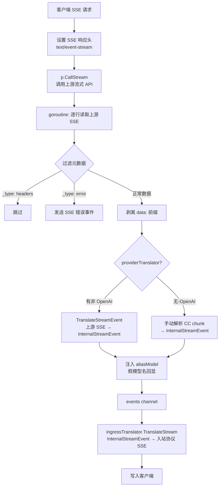
```mermaid
flowchart TD
    A[客户端 SSE 请求] --> B[设置 SSE 响应头<br/>text/event-stream]
    B --> C[p.CallStream<br/>调用上游流式 API]
    C --> D[goroutine: 逐行读取上游 SSE]
    D --> E{过滤元数据}
    E -->|_type: headers| F[跳过]
    E -->|_type: error| G[发送 SSE 错误事件]
    E -->|正常数据| H[剥离 data: 前缀]
    H --> I{providerTranslator?}
    I -->|有非 OpenAI| J[TranslateStreamEvent<br/>上游 SSE → InternalStreamEvent]
    I -->|无-OpenAI| K[手动解析 CC chunk<br/>→ InternalStreamEvent]
    J --> L[注入 aliasModel<br/>假模型名回显]
    K --> L
    L --> M[events channel]
    M --> N[ingressTranslator.TranslateStream<br/>InternalStreamEvent → 入站协议 SSE]
    N --> O[写入客户端]
```

#### 场景 B：入站非流式 → 上游流式 → 出站 JSON（`handleStreamRequestAsNonStream`）❌ 当前不可达

`--stream-mode stream` 在 v0.2.60 已移除，翻译路径不再覆写 `internalReq.Stream`，因此**不会出现**「客户端非流式但上游流式」的组合。该函数在 `internal/server/` 中已无任何调用点，仅在 `@AI_GUARD` 注释中被交叉引用。保留其原始描述供历史参考：

若该路径被恢复启用，关键处理步骤为：

1. **先写响应头**：`WriteHeader(200)` + `Flush()` 启用 chunked transfer，防止上游响应慢时客户端超时
2. **调用上游流式 API**：`p.CallStream()` 获取 SSE 流
3. **逐行收集 SSE 事件**：与场景 A 相同，经过元数据过滤 → 剥离 `data:` 前缀 → `TranslateStreamEvent` → 模型别名注入
4. **累积模式**（与场景 A 的核心区别）：不实时输出 SSE，而是收集所有 `InternalStreamEvent`：
   - 文本内容累积到 `contentBuilder`（`strings.Builder`）
   - 推理内容累积到 `reasoningBuilder`
   - 最后一个有效的 `finish_reason` 覆盖记录
   - `usage` 从最后一个含 `usage` 的事件中提取
5. **组装 InternalResponse**：将累积内容、finish\_reason、usage 组装为完整的 `InternalResponse`
6. **翻译为入站协议 JSON**：`ingressTranslator.TranslateResponse(ctx, internalResp)` → 入站协议完整 JSON
7. **写入客户端**：`json.NewEncoder(w).Encode(resp)`

元数据事件（`_type: "headers"`）被解析后用于透传响应头。

#### 场景 C：入站非流式 → 上游非流式 → 出站 JSON（`handleNonStreamResponse`）

翻译路径的标准非流式处理，客户端发非流式请求，上游也走非流式，返回完整 JSON。

**关键处理步骤：**

1. **翻译请求**：`ingressTranslator.TranslateRequest()` → `InternalRequest` → `providerTranslator.TranslateToProvider()` → 下游请求体
2. **调用上游非流式 API**：`p.Call()` 返回完整 JSON 响应
3. **翻译响应**：`providerTranslator.TranslateFromProvider()` → `InternalResponse` → `ingressTranslator.TranslateResponse()` → 入站协议 JSON
4. **模型别名回显**：响应中的 `model` 字段替换为客户端假模型名

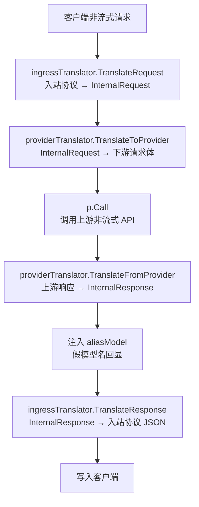
```mermaid
flowchart TD
    A[客户端非流式请求] --> B[ingressTranslator.TranslateRequest<br/>入站协议 → InternalRequest]
    B --> C[providerTranslator.TranslateToProvider<br/>InternalRequest → 下游请求体]
    C --> D[p.Call<br/>调用上游非流式 API]
    D --> E[providerTranslator.TranslateFromProvider<br/>上游响应 → InternalResponse]
    E --> F[注入 aliasModel<br/>假模型名回显]
    F --> G[ingressTranslator.TranslateResponse<br/>InternalResponse → 入站协议 JSON]
    G --> H[写入客户端]
```

#### 场景 D：入站流式 → 上游非流式 → 出站 SSE（`handleNonStreamResponseAsSSE`）❌ 当前不可达

`--stream-mode non-stream` 在 v0.2.60 已移除，翻译路径不再覆写 `internalReq.Stream`，因此**不会出现**「客户端流式但上游非流式」的组合。该函数在 `internal/server/` 中已无任何调用点。

**注意：同名不同路径。** 透传路径的 `handlePassthroughNonStreamAsSSE` **仍然活跃**（场景 6/7 的可达路径），负责把上游非流式 JSON 拆解为入站协议 SSE 事件流。两者差异在于翻译路径多一步 `TranslateResponse`（上游协议 JSON → 入站协议 JSON），再拆解为 SSE；透传路径直接拆解原始 JSON。

### 协议感知路由

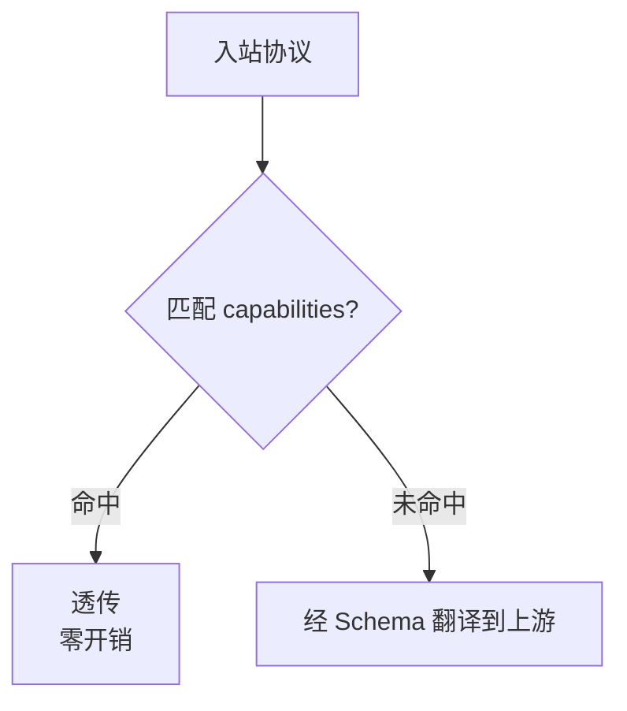
```mermaid
flowchart TD
    A[入站协议] --> B{匹配 capabilities?}
    B -->|命中| C[透传<br/>零开销]
    B -->|未命中| D[经 Schema 翻译到上游]
```

***

## 消息转换流转图

> ⚠️ 本节 SVG 图由 `docs/draw_flow.py` 生成，仍基于 v0.2.60 之前的 `--stream-mode` 四种模式设计，**图中标注的 `--stream-mode stream` / `non-stream` 已不存在**。自 v0.2.60 起流式路由完全由请求体 `stream` 字段 + `streamPrefer` 探测决定，下方每场景说明给出**当前实际可达性**。

**当前可达场景只有 4 个：1、2、6、7。** 场景 3、4、5、8、9 描述的「入站流式取值 ≠ 上游流式取值」组合，在移除 `--stream-mode` 后已不可达——翻译路径原样保留 `internalReq.Stream`，透传路径也不注入 `stream:true`。

### 全览

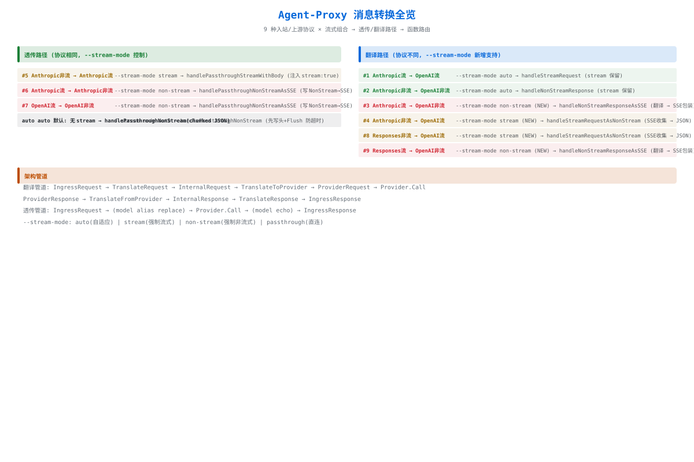

### 场景 1：Anthropic 流式 → OpenAI 流式 ✅ 可达

**翻译路径** — `TranslateRequest(Anthropic) → InternalRequest → TranslateToProvider(OpenAI)`，`stream:true` 原样保留 → `handleStreamRequest` → 上游 SSE → 出站 SSE。

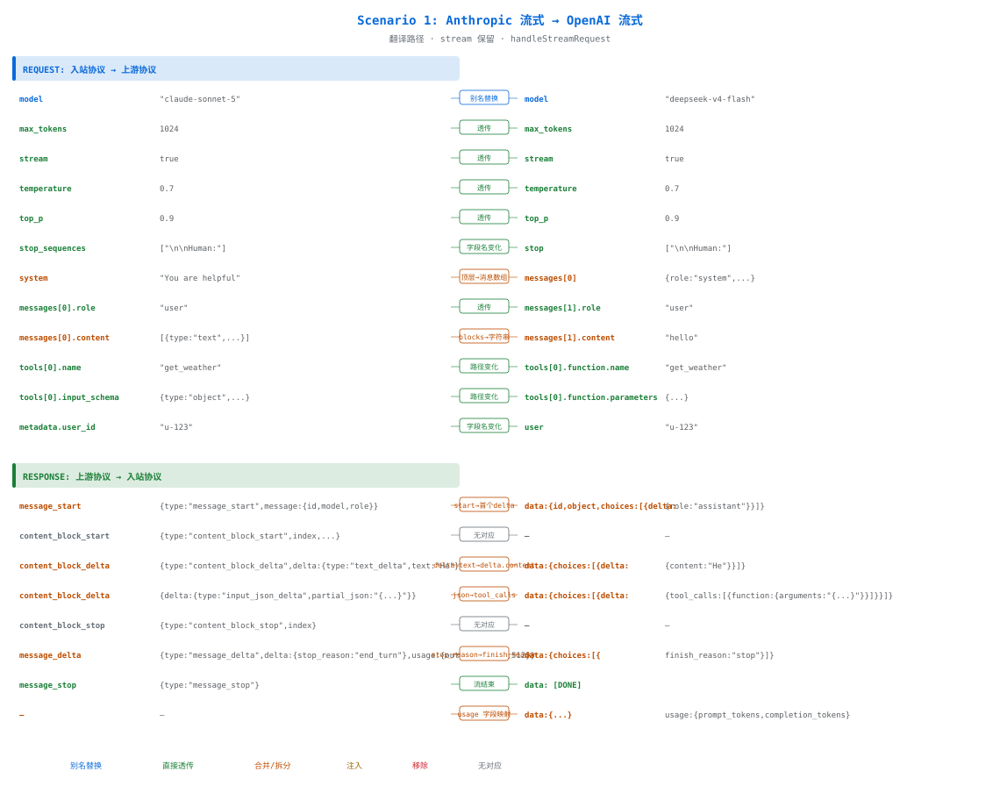

### 场景 2：Anthropic 非流式 → OpenAI 非流式 ✅ 可达

**翻译路径** — `TranslateRequest → TranslateToProvider`，`stream` 缺省/false → `handleNonStreamResponse` → 上游非流式 JSON → 出站 JSON。

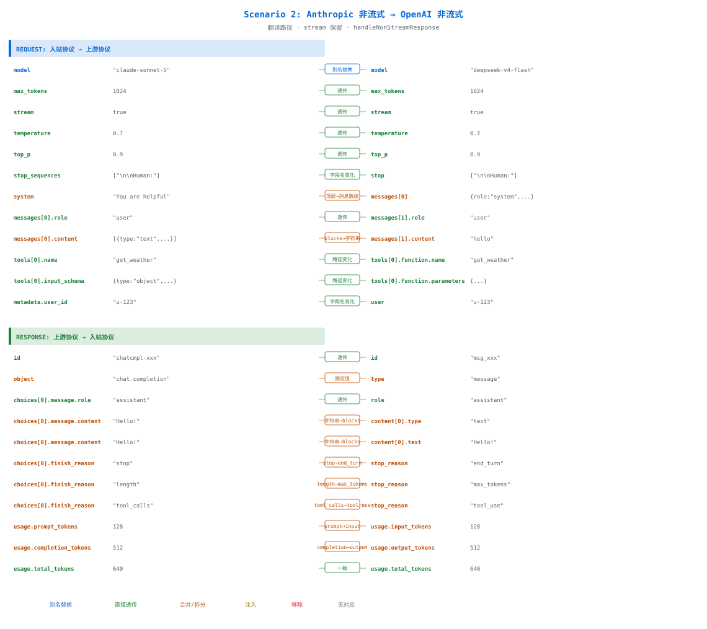

### 场景 3：Anthropic 流式 → OpenAI 非流式 ❌ 当前不可达

原需 `--stream-mode non-stream` 强制上游非流式。现在入站 `stream:true` 会原样传递，上游同样走流式，实际退化为场景 1。`handleNonStreamResponseAsSSE` 虽仍存在（翻译路径非流式→SSE 包装），但**在 `internal/server/` 中已无任何调用点**，仅被 `@AI_GUARD` 注释交叉引用。

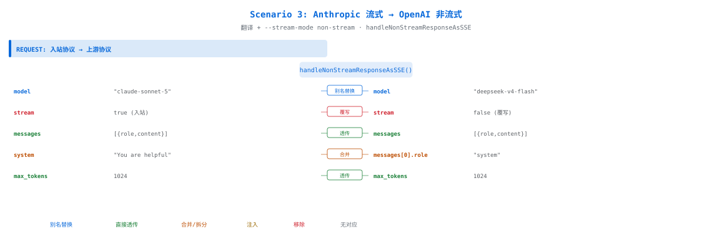

### 场景 4：Anthropic 非流式 → OpenAI 流式 ❌ 当前不可达

原需 `--stream-mode stream` 强制上游流式。现在入站 `stream` 缺省则上游也非流式，实际退化为场景 2。`handleStreamRequestAsNonStream` 同样已无调用点。

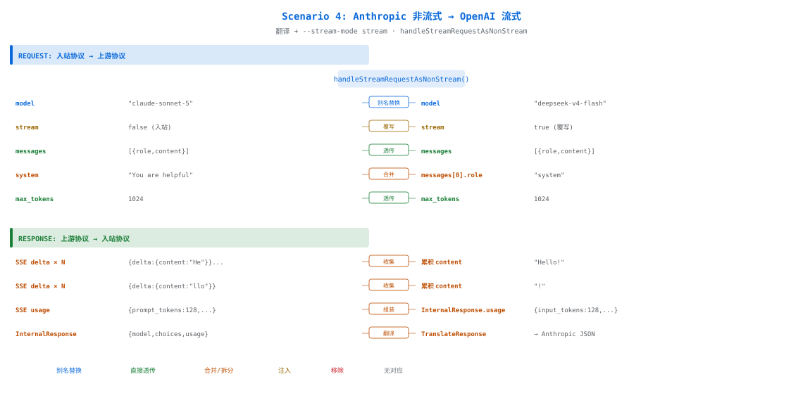

### 场景 5：Anthropic 非流式 → Anthropic 流式 ❌ 当前不可达

原需 `--stream-mode stream` 注入 `stream:true`。现在透传路径不再注入 `stream` 字段，无 `stream` 即走上游非流式（Anthropic API 标准：`stream` 缺省 = false）。

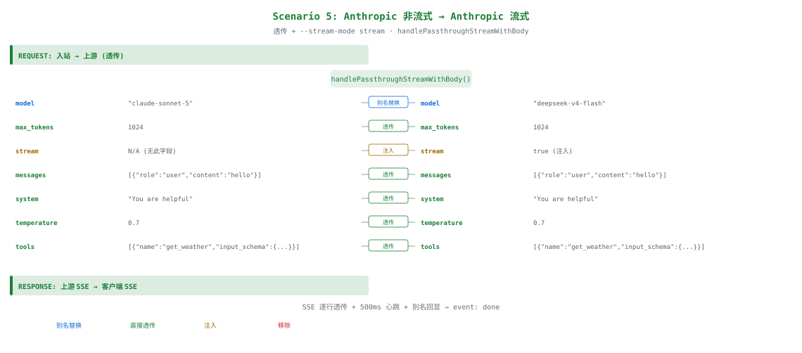

### 场景 6：Anthropic 流式 → Anthropic 非流式 ✅ 可达（自适应路径）

**透传路径** — 入站 `stream:true` + `streamPrefer` 判定非流式更快（首次请求默认值，或探测结论），或 body > 100KB 触发 `LARGE_BODY_SKIP_STREAM` → `handlePassthroughNonStreamAsSSE`：上游非流式 JSON → `writeNonStreamAsSSE` 拆解为入站协议 SSE 事件流。

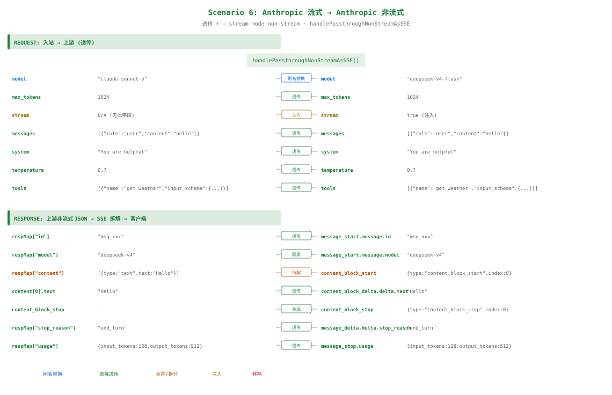

### 场景 7：OpenAI 流式 → OpenAI 非流式 ✅ 可达（自适应路径）

同场景 6，仅入站/上游协议换为 OpenAI ChatCompletion。SSE 拆解格式为 CC chunk（`choices[0].delta`）。

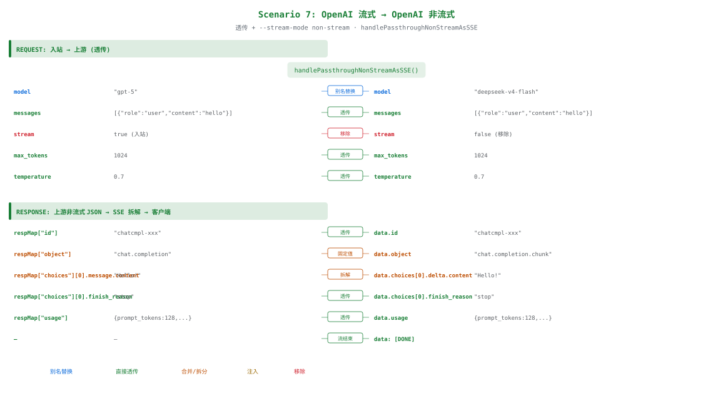

### 场景 8：Responses 非流式 → OpenAI 流式 ❌ 当前不可达

同场景 4，入站 `stream` 缺省则上游非流式。`handleStreamRequestAsNonStream` 无调用点。

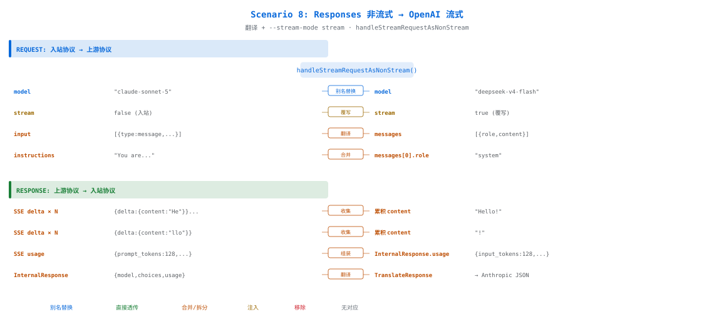

### 场景 9：Responses 流式 → OpenAI 非流式 ❌ 当前不可达

同场景 3，入站 `stream:true` 原样传递上游。`handleNonStreamResponseAsSSE` 无调用点。

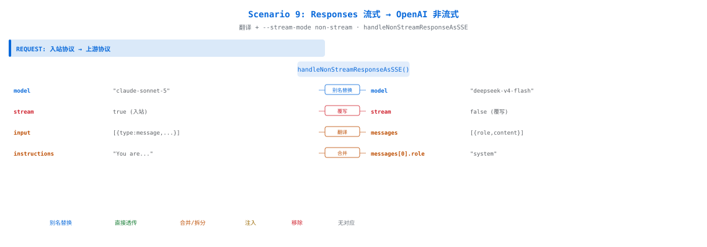

> 需要更新 SVG 时运行 `python docs/draw_flow.py`（需同步移除其中 20 处 `--stream-mode` 标注）。

***

## Claude Code 特殊处理

Claude Code 使用 fable 原生模型时，agent-proxy 的完整请求处理流程见 [claude\_code\_flow.svg](claude_code_flow.svg)，包含三个阶段：

1. **验证请求**（启动 / `/model` 切换）— 不带 `stream` 字段，走 `handlePassthroughNonStreamAsSSE`（上游非流式 + SSE 包装 + 心跳）
2. **首次对话请求**（`stream:true`，未探测）— 仍走非流式上游 + SSE 包装，同时后台 `probeStreamPrefer` 异步探测 SSE 速度
3. **后续对话请求**（已探测）— 按 `streamPrefer[baseURL]` 分流：非流式更快走 `NonStreamAsSSE`，SSE 更快走 `handlePassthroughStream`

### 关键设计决策

| 问题                       | 决策                         | 原因                                                 |
| ------------------------ | -------------------------- | -------------------------------------------------- |
| 验证请求不带 `stream` 字段       | 走 `NonStreamAsSSE`（SSE 包装） | Claude Code 的 SSE 解析器期望流式事件，`stream:false` 才走 JSON |
| 心跳格式                     | `event: ping\ndata: {"type":"ping"}\n\n`（标准 Anthropic ping 事件） | Claude Code 只识别带 `event:` 前缀的 ping 事件并重置超时；其他格式（`data: {}`、`: heartbeat`、`data: {"type":"ping"}` 无 `event:`）均不识别或不合规 |
| 首次流式请求                   | 仍走非流式上游                    | 用于探测基准，避免首次就 SSE 导致 ECONNRESET                     |
| `streamPrefer` 按 baseURL | 独立存储                       | 多上游互不干扰                                            |

### Claude Code 客户端校验约束（v0.2.67-v0.2.74 血泪教训）

Claude Code 客户端对响应字段有严格校验，以下问题均会导致会话异常，已在代码中通过 `@AI_GUARD` 标记固化：

| 问题症状 | 根因 | 修复版本 | 修复位置 |
| --- | --- | --- | --- |
| `API returned an empty or malformed response (HTTP 200)` | `message_start` 的 `id` 字段为空字符串 | v0.2.67 | [anthropic/translator.go](file:///f:/src/agent-proxy/internal/protocol/anthropic/translator.go#L421-L434) |
| `undefined is not an object (evaluating 'K.usage.input_tokens')` | 上游不返回 `usage` 字段，Claude Code 校验 `usage.input_tokens` 时崩溃 | v0.2.68 | [quick.go](file:///f:/src/agent-proxy/internal/server/quick.go#L717-L785) `fixNullUsageInResponse` |
| `API returned an empty or malformed response (HTTP 200)`（流式） | `message_start.usage.output_tokens` 硬编码为 `1`，且 `message_delta` 缺失 `usage` 字段 | v0.2.68 | [anthropic/translator.go](file:///f:/src/agent-proxy/internal/protocol/anthropic/translator.go#L427) `output_tokens:0` |
| `Connection to the API was lost (ECONNRESET)` | 大请求（>100KB）流式处理 12-18s 才失败，客户端等不及断开；降级请求复用已取消的 ctx | v0.2.73-v0.2.74 | [quick.go](file:///f:/src/agent-proxy/internal/server/quick.go#L459-L475) 大请求阈值 + 独立 ctx 降级 |

**关键修复函数：**
- `fixNullUsageInResponse`: 透传响应中 `usage` 为 `null` 或缺失时补默认值，按响应格式（Anthropic `content[]` / CC `choices[]`）生成对应字段名
- `extractUsage`: 修复全零值误判，仅当无任何可识别 token 数字时返回 `nil`
- `writeNonStreamAsSSE` Anthropic 分支：`message_start` 中 `output_tokens` 必须为 `0`；`message_delta` 始终发送，`usage` 为 `nil` 时默认 `output_tokens:0`

***

## Codex 客户端特殊处理

Codex CLI 使用 OpenAI Responses 协议（`/v1/responses`），对 SSE 事件生命周期有严格校验。

### Codex 校验约束（v0.2.75 血泪教训）

| 问题症状 | 根因 | 修复版本 | 修复位置 |
| --- | --- | --- | --- |
| `stream disconnected before completion: stream closed before response.completed` | `TranslateStream` 使用非标准 `data` 字段（应为 `response`）和非标准事件类型 `response.output_delta`（应为 `response.output_text.delta`），缺少 `response.output_item.added` / `response.output_item.done` 事件，`response.completed` 的 `output[]` 为空 | v0.2.75 | [responses/translator.go](file:///f:/src/agent-proxy/internal/protocol/responses/translator.go#L350-L363) `TranslateStream` 重写 |

### Codex 要求的标准 Responses API SSE 事件序列

```
response.created → response.output_item.added → response.output_text.delta*
→ response.output_item.done → response.completed → data: [DONE]
```

**关键约束：**
- `response.created` / `response.completed` 事件数据必须用 `response` 字段（非 `data`）
- `response.output_text.delta` 事件必须用 `delta` 字段（字符串），而非 `data.output_delta`
- `response.output_item.added` / `response.output_item.done` 必须包含 `item` 字段（含 `id`、`type:"message"`、`role:"assistant"`、`content[]`）
- `response.completed` 的 `response.output[]` 必须包含累积的完整内容（非空数组）
- channel 关闭或 `ctx.Done()` 时必须补发完整结束序列再发 `[DONE]`

***

## 扩展开发

### 新增协议

1. **定义类型**（`internal/protocol/mymodule/types.go`）：

```go
type MyRequest struct {
    Messages []Message `json:"messages"`
    Model    string    `json:"model"`
}
```

1. **实现翻译器**（`internal/protocol/mymodule/translator.go`），需实现 `CombinedTranslator` 接口：

```go
type MyTranslator struct{}

func (t *MyTranslator) TranslateRequest(ctx context.Context, raw json.RawMessage) (*schema.InternalRequest, error) {}
func (t *MyTranslator) TranslateToProvider(req *schema.InternalRequest) (json.RawMessage, error) {}
func (t *MyTranslator) TranslateFromProvider(raw json.RawMessage) (*schema.InternalResponse, error) {}
func (t *MyTranslator) TranslateResponse(resp *schema.InternalResponse) (json.RawMessage, error) {}
func (t *MyTranslator) TranslateStream(ctx context.Context, events <-chan schema.InternalStreamEvent, fn func([]byte, bool)) {}
func (t *MyTranslator) TranslateError(err *schema.StreamError) json.RawMessage {}
```

1. **注册 Provider 客户端**（`internal/provider/mymodule.go`）：

```go
type MyClient struct { baseURL string; timeout int }

func (c *MyClient) Call(ctx context.Context, body json.RawMessage, info *schema.ProviderInfo) (
    json.RawMessage, map[string][]string, error) { ... }

func (c *MyClient) CallStream(ctx context.Context, body json.RawMessage, info *schema.ProviderInfo) (
    <-chan json.RawMessage, map[string][]string, error) { ... }
```

1. **在** **`gateway.go`** **中注册路由**。

### 新增假模型名

在 `internal/db/aliasfile.go` 的 `DefaultAliases()` 函数的 `names` 切片追加名字即可。

***

## 关键源码文件索引

| 文件                                               | 职责                                                     |
| ------------------------------------------------ | ------------------------------------------------------ |
| `main.go`                                        | CLI 入口、启动模式分发                                          |
| `internal/server/quick.go`                       | 快速模式核心：路由决策、透传路径、SSE 包装、心跳、自适应探测                       |
| `internal/provider/openai.go`                    | Provider 客户端：OpenAI/Anthropic/Gemini/Responses HTTP 调用 |
| `internal/protocol/anthropic/translator.go`      | Anthropic 翻译器：入站/出站翻译 + 流式事件转换                         |
| `internal/protocol/chatcompletion/translator.go` | ChatCompletion 翻译器                                     |
| `internal/protocol/gemini/translator.go`         | Gemini 翻译器                                             |
| `internal/protocol/responses/translator.go`      | Responses 翻译器                                          |
| `internal/db/aliasfile.go`                       | 别名映射：三层加载、自映射、DefaultAliases                           |
| `internal/translator/registry.go`                | 翻译器注册表                                                 |
| `internal/config/config.go`                      | 复杂模式配置                                                 |

