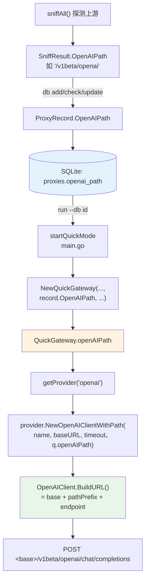
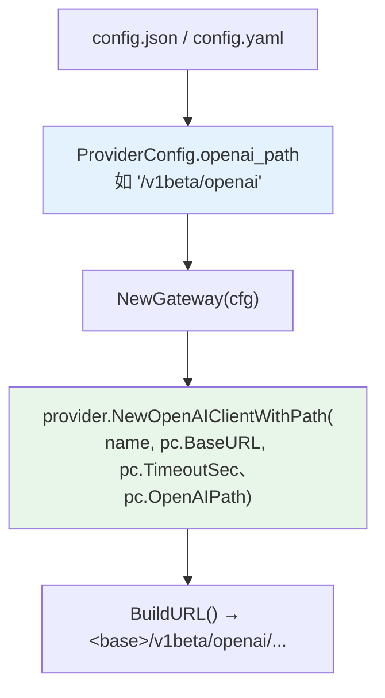
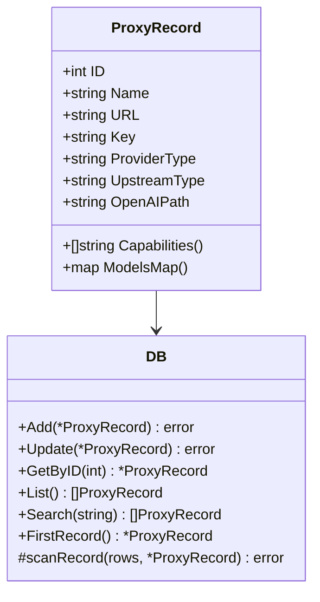

# Agent-Proxy — OpenAIPath 端到端传递链

> 代理如何发现并携带一个非标准 OpenAI 兼容端点前缀（如 Google Gemini 的 `/v1beta/openai`），从发现一路贯穿到 HTTP 请求，在**快速模式**和**复杂模式**下都成立。
>
> 标准 OpenAI / vLLM / SGLang 端点都在 `/v1`。Google Gemini 的 OpenAI 兼容端点则在 `/v1beta/openai`。如果不传递这个前缀，代理会始终 POST 到 `&lt;base&gt;/v1/...`，Gemini 那边就 404。

---

## 1. 问题

```mermaid
sequenceDiagram
    participant C as 客户端
    participant P as 代理
    participant G as Google Gemini

    C->>P: POST /v1/chat/completions
    Note over P: 默认前缀 = /v1
    P->>G: POST &lt;base&gt;/v1/chat/completions
    G-->>P: 404（路径错了）
```

修法：让探测发现真实前缀、把它持久化、再一路注入 provider 的 `BuildURL()`。

---

## 2. 端到端流程（快速模式，`agent-proxy run --db <id>`）



**空前缀 = 标准 `/v1`。** `NewOpenAIClientWithPath` 把 `""` 归一为 `"/v1"`，非 Gemini 上游不受影响。

---

## 3. 端到端流程（复杂模式，`--mode complex` / 配置文件）



复杂模式从配置而不是 DB 读前缀 —— 同一个 provider 构造函数，同样的归一化。

---

## 4. `openai_path` 在 DB 里的位置

`db.go` 在 `Init()` 时通过迁移补列，并一路传给每个读写路径：



`proxies` 表为 OpenAIPath 触碰的列：

```sql
ALTER TABLE proxies ADD COLUMN openai_path TEXT;   -- 幂等迁移

INSERT INTO proxies (..., upstream_type, openai_path, ...) VALUES (..., ?, ?, ...);
SELECT ..., upstream_type, openai_path, ... FROM proxies ...;
UPDATE proxies SET ..., upstream_type = ?, openai_path = ? WHERE id = ?;
```

所有 SELECT（`GetByID`、`List`、`Search`、`FirstRecord`）都通过 `scanRecord` 把它读进 `ProxyRecord.OpenAIPath`。

---

## 5. CLI 写路径（`cmd/cli.go`）

每个触碰探测的命令都会把发现的前缀持久化：

| 命令 | 代码 |
|---|---|
| `db add` / `db detect` | `ProxyRecord{OpenAIPath: result.OpenAIPath, ...}` 再 `store.Add(r)` |
| `db check` | `r.OpenAIPath = sniffResult.OpenAIPath` 再 `store.Update(r)` |
| `db update` | `r.OpenAIPath = result.OpenAIPath` 再 `store.Update(r)` |

这让"重新探测"与"新增"保持一致：上游换了前缀（比如某个端点迁移），`db check` / `db update` 会把新值写回去，`run --db <id>` 立刻就能用上。

---

## 6. Provider 构造函数

`internal/provider/openai.go`：

```go
// 默认 —— 向后兼容，除自定义前缀外到处用
func NewOpenAIClient(name, baseURL string, timeout int) *OpenAIClient {
    return newOpenAIClient(name, baseURL, timeout, "/v1")
}

// 自定义前缀（如 Google Gemini 的 "/v1beta/openai"）；空串 → "/v1"
func NewOpenAIClientWithPath(name, baseURL string, timeout int, pathPrefix string) *OpenAIClient {
    if pathPrefix == "" {
        pathPrefix = "/v1"
    }
    return newOpenAIClient(name, baseURL, timeout, pathPrefix)
}
```

`OpenAIClient` 内的 `BuildURL()` 把 `<baseURL>/<pathPrefix>/<endpoint>` 拼接起来（如 `/chat/completions`），对 Gemini 产出 `<base>/v1beta/openai/chat/completions`。

---

## 7. 向后兼容

- `NewOpenAIClient` 不变 —— 任何现存调用点继续可用，仍假设 `/v1`。
- `ProxyRecord.OpenAIPath` 在 DB 里默认 `""`（无列 = 无前缀覆盖）。没有该列的老 DB 记录行为完全不变（`""` → `"/v1"`）。
- `ProviderConfig.OpenAIPath` 在配置里默认 `""`。老配置文件省略它，得到 `/v1`。
- Gemini 原生客户端（`NewGeminiClient`）不受影响 —— 它走 Gemini 协议路径，不走 OpenAI 兼容路径。
