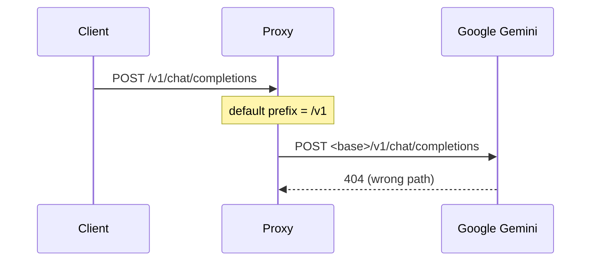
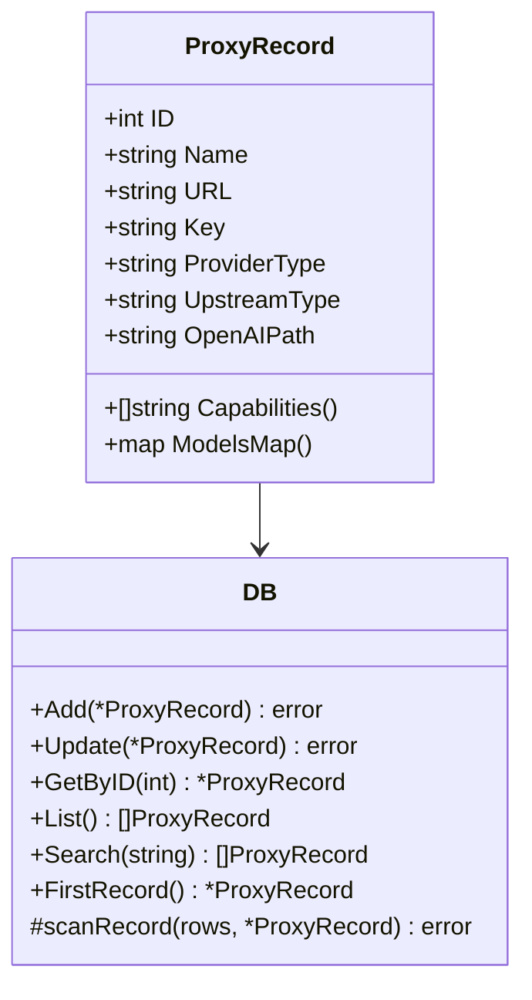

# Agent-Proxy — OpenAIPath Propagation Chain

> How the proxy discovers and carries a non-standard OpenAI-compatible endpoint prefix (e.g. Google Gemini's `/v1beta/openai`) all the way from discovery to the HTTP request, in **both** Quick mode and Complex mode.
>
> Standard OpenAI / vLLM / SGLang endpoints live at `/v1`. Google Gemini's OpenAI-compatible endpoint lives at `/v1beta/openai`. Without carrying this prefix, the proxy would always POST to `<base>/v1/...` and 404 on Gemini.

---

## 1. The Problem



The fix: let sniffing discover the real prefix, persist it, and thread it into the provider's `BuildURL()`.

---

## 2. End-to-End Flow (Quick mode, `agent-proxy run --db <id>`)

```mermaid
flowchart TD
    A[sniffAll() probes upstream] --> B[SniffResult.OpenAIPath<br/>e.g. "/v1beta/openai"]

    B -->|add/check/update| C[ProxyRecord.OpenAIPath]
    C --> D[(SQLite: proxies.openai_path)]

    D -->|run --db id| E[startQuickMode<br/>main.go]
    E --> F[NewQuickGateway(...,<br/>record.OpenAIPath, ...)]

    F --> G[QuickGateway.openAIPath]
    G --> H[getProvider("openai")]
    H --> I[provider.NewOpenAIClientWithPath(<br/>name, baseURL, timeout,<br/>q.openAIPath)]

    I --> J[OpenAIClient.BuildURL()<br/>= base + pathPrefix + endpoint]
    J --> K[POST <base>/v1beta/openai/chat/completions]

    style D fill:#e3f2fd
    style G fill:#fff3e0
    style J fill:#e8f5e9
```

**Empty prefix = standard `/v1`.** `NewOpenAIClientWithPath` normalizes `""` → `"/v1"`, so non-Gemini upstreams are untouched.

---

## 3. End-to-End Flow (Complex mode, `--mode complex` / config file)

```mermaid
flowchart TD
    A[config.json / config.yaml] --> B[ProviderConfig.openai_path<br/>e.g. "/v1beta/openai"]
    B --> C[NewGateway(cfg)]
    C --> D[provider.NewOpenAIClientWithPath(<br/>name, pc.BaseURL, pc.TimeoutSec,<br/>pc.OpenAIPath)]
    D --> E[BuildURL() → <base>/v1beta/openai/...]

    style B fill:#e3f2fd
    style D fill:#e8f5e9
```

The complex-mode path reads the prefix from config rather than from DB — same provider constructor, same normalization.

---

## 4. Where `openai_path` Lives in the DB

`db.go` adds the column via migration at `Init()` and threads it through every read/write path:



The `proxies` table columns touched for OpenAIPath:

```sql
ALTER TABLE proxies ADD COLUMN openai_path TEXT;   -- idempotent migration

INSERT INTO proxies (..., upstream_type, openai_path, ...) VALUES (..., ?, ?, ...);
SELECT ..., upstream_type, openai_path, ... FROM proxies ...;
UPDATE proxies SET ..., upstream_type = ?, openai_path = ? WHERE id = ?;
```

All SELECTs (`GetByID`, `List`, `Search`, `FirstRecord`) read it into `ProxyRecord.OpenAIPath` via `scanRecord`.

---

## 5. CLI Write Paths (`cmd/cli.go`)

Every command that touches sniffing persists the discovered prefix:

| Command | Code |
|---|---|
| `db add` / `detect` | `ProxyRecord{OpenAIPath: result.OpenAIPath, ...}` before `store.Add(r)` |
| `db check` | `r.OpenAIPath = sniffResult.OpenAIPath` before `store.Update(r)` |
| `db update` | `r.OpenAIPath = result.OpenAIPath` before `store.Update(r)` |

This keeps `re-sniff` consistent with `add`: if the upstream changes its prefix (e.g., an endpoint moves), `db check` / `db update` writes the new value back so `run --db <id>` picks it up.

---

## 6. Provider Constructor

`internal/provider/openai.go`:

```go
// default — backward-compatible, used everywhere except where a custom prefix is needed
func NewOpenAIClient(name, baseURL string, timeout int) *OpenAIClient {
    return newOpenAIClient(name, baseURL, timeout, "/v1")
}

// custom prefix (e.g. Google Gemini "/v1beta/openai"); empty → "/v1"
func NewOpenAIClientWithPath(name, baseURL string, timeout int, pathPrefix string) *OpenAIClient {
    if pathPrefix == "" {
        pathPrefix = "/v1"
    }
    return newOpenAIClient(name, baseURL, timeout, pathPrefix)
}
```

`BuildURL()` inside `OpenAIClient` then concatenates `<baseURL>/<pathPrefix>/<endpoint>` (e.g. `/chat/completions`), producing `<base>/v1beta/openai/chat/completions` for Gemini.

---

## 7. Backward Compatibility

- `NewOpenAIClient` unchanged — any existing call site still works, still assumes `/v1`.
- `ProxyRecord.OpenAIPath` defaults to `""` in DB (no column = no prefix override). Old DB records without the column behave exactly as before (`""` → `"/v1"`).
- `ProviderConfig.OpenAIPath` defaults to `""` in config. Old config files omit it and get `/v1`.
- Gemini's native client (`NewGeminiClient`) is unaffected — it uses the Gemini protocol path, not the OpenAI-compatible one.