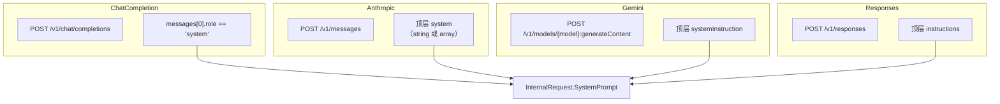
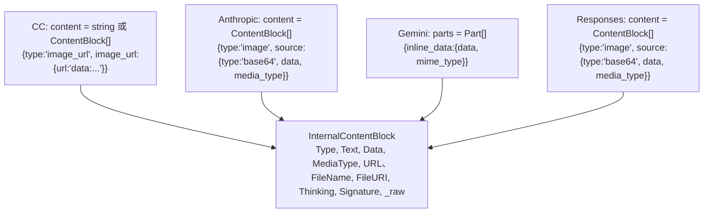
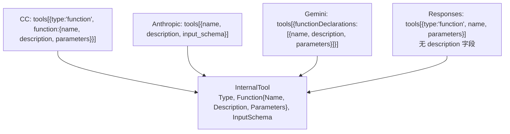
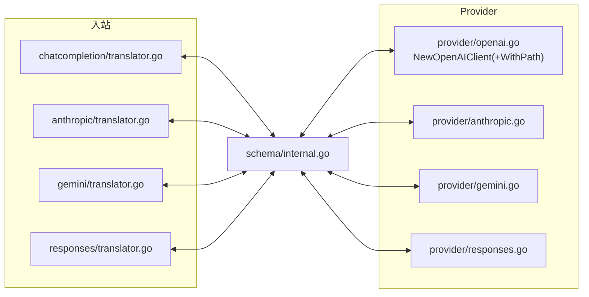

# Agent-Proxy — 协议对比

> 四种协议逐字段差异。这是翻译器归一化进 / 出 Central Schema 时的参考。
>
> [`ARCHITECTURE.md`](ARCHITECTURE.md)（Central Schema）与 [`REQUEST_LIFECYCLE.md`](REQUEST_LIFECYCLE.md)（事件序列）的配套文档。

---

## 1. 端点与 System Prompt

| | ChatCompletion | Anthropic | Gemini | Responses |
|---|---|---|---|---|
| 端点 | `POST /v1/chat/completions` | `POST /v1/messages` | `POST /v1/models/{model}:generateContent` | `POST /v1/responses` |
| System prompt | `messages[0].role=="system"` | 顶层 `system`（string 或 array） | 顶层 `systemInstruction` | 顶层 `instructions` |
| Role 集合 | user / assistant / system / tool | user / assistant（system 抽出） | user / model（system 抽出） | user / assistant（system 抽出） |

**Central Schema 规则**：system 总是抽到 `InternalRequest.SystemPrompt`；`InternalRequest.Messages` 绝不含 system。反向翻译回 CC 时，system 消息作为 `messages[0]` 重新插入。

---

## 2. 内容（文本 + 多模态）

| | 文本 | 图片（base64） | 图片（URL） | 文件 | Thinking |
|---|---|---|---|---|---|
| ChatCompletion | `content: string` 或 `{type:"text",text}` | `{type:"image_url", image_url:{url:"data:image/..."}}` | `{type:"image_url", image_url:{url:"https://..."}}` | — | — |
| Anthropic | `{type:"text",text}` | `{type:"image", source:{type:"base64",data,media_type}}` | `{type:"image", source:{type:"url",url}}` | — | `{type:"thinking",thinking}` |
| Gemini | `parts` 里的 `{text:"..."}` | `parts` 里的 `{inline_data:{data,mime_type}}` | `{file_data:{file_uri,mime_type}}` | `{file_data:{...}}` | — |
| Responses | `{type:"output_text",text}` | `{type:"image", source:{type:"base64",data,media_type}}` | `{type:"image", source:{type:"url",url}}` | — | — |

`InternalContentBlock` 用 `_raw`（`json.RawMessage`）作为协议专属字段的兜底。

---

## 3. Tools / 函数调用

兼容性表面最复杂的一块。

**定义（客户端发送）：**

**调用（模型返回）：**

| 协议 | 位置 | ID 命名 | 参数形态 |
|---|---|---|---|
| ChatCompletion | `message.tool_calls: [{id, type:"function", function:{name, arguments}}]` | 任意 | `arguments` = JSON **字符串** |
| Anthropic | `content: [{type:"tool_use", id, name, input}]` | `toolu_xxx` | `input` = JSON **对象** |
| Gemini | `parts: [{functionCall:{name, args}}]` | 无（代理生成 ID 映射） | `args` = JSON **对象** |
| Responses | `tool_calls: [{id, type:"function", name, input}]` | `responses_xxx` | `input` = JSON **对象** |

**结果（喂回去）：**

| 协议 | 形态 |
|---|---|
| ChatCompletion | `messages[{role:"tool", tool_call_id, content:"result"}]` |
| Anthropic | `messages[{role:"user", content:[{type:"tool_result", tool_use_id, content}]}]` |
| Gemini | `contents[{role:"user", parts:[{functionResponse:{name, response:{result}}}]}]` |
| Responses | `input[{type:"message", role:"user", content:[{type:"tool_result", ...}]}]` |

**关键兼容规则：**

1. `arguments`（CC）是 JSON **字符串** ↔ `input` / `args`（其他）是 JSON **对象** → 翻译器在边界 Marshal / Unmarshal。
2. Anthropic 把 `tool_calls` 藏在 `content[]` 里 —— 解析要扫描每个 content block。
3. Gemini 无 `tool_call_id` 概念 → 代理生成唯一 ID 并维护映射。
4. `InternalContentBlock._raw` 保留协议专属的 tool 字段。

---

## 4. 响应格式（结构化输出）

| | 文本 | JSON 对象 | JSON schema |
|---|---|---|---|
| ChatCompletion | `{type:"text"}` | `{type:"json_object"}` | — |
| Anthropic | — | — | 工具驱动或新的 `response_format` |
| Gemini | `responseMimeType:"text/plain"` | `responseMimeType:"application/json"` | 通过 `schema` |
| Responses | `{type:"text"}` | `{type:"json_object"}` | `{type:"json_schema", json_schema:{...}}` |

统一为 `InternalResponseFormat{Type, JsonSchema}`。

---

## 5. Usage（Token 计费）

Claude Code 客户端在 `usage` 为 null / 缺失时会 crash。

| | 输入 | 输出 | 合计 | 缓存专属 |
|---|---|---|---|---|
| ChatCompletion | `prompt_tokens` | `completion_tokens` | `total_tokens` | — |
| Anthropic | `input_tokens` | `output_tokens` | `total_tokens` | — |
| Gemini | `prompt_token_count` | `candidates_token_count` | `total_token_count` | — |
| Responses | `input_tokens` | `output_tokens` | `total_tokens` | `cache_creation_tokens`, `cache_read_tokens` |

统一为 `InternalUsage{PromptTokens, CompletionTokens, TotalTokens, CacheCreationTokens, CacheReadTokens}`。

代理还在透传响应中回填缺失的 usage（`quick.go:fixNullUsageInResponse`），用合理零值：
- Anthropic 形态（`content[]`）→ `{"input_tokens":0,"output_tokens":0}`
- CC 形态（`choices[]`）→ `{"prompt_tokens":0,"completion_tokens":0,"total_tokens":0}`
- 未知形态 → 两种字段都写，安全兜底

---

## 6. SSE 事件格式

| | 行格式 | 起始 | Delta | 结束 |
|---|---|---|---|---|
| ChatCompletion | 纯 `data:` | 首个 chunk 带 `role:"assistant"` | `delta:{content:"..."}` | `finish_reason:"stop"` 后 `data: [DONE]` |
| Anthropic | `data:` 里的 `{type:"..."}` | `message_start`（content=[], id=msg_&lt;ts&gt;, output_tokens=0） | `content_block_delta:{delta:{type:"text_delta",text}}` | `content_block_stop → message_delta → message_stop` |
| Gemini | 逐行原始 JSON，无 `event:` | `candidates[0].content.parts[0].text` | 同一形态，累积 | 最后一个 chunk 带 `usageMetadata` |
| Responses | `event: response.*` 命名 | `response.created`（数据在 `response` 字段） | `response.output_text.delta`（数据在 `delta` 字段） | `response.output_item.done → response.completed`（数据在 `response` 字段） |

代理的翻译器强制**完整**事件生命周期（含取消安全结束——即使上游通道提前关闭也发完收尾事件）。这是让严格客户端（Claude Code、Codex）不拒绝流的关键。

---

## 7. 快速参考：哪个翻译器处理什么

