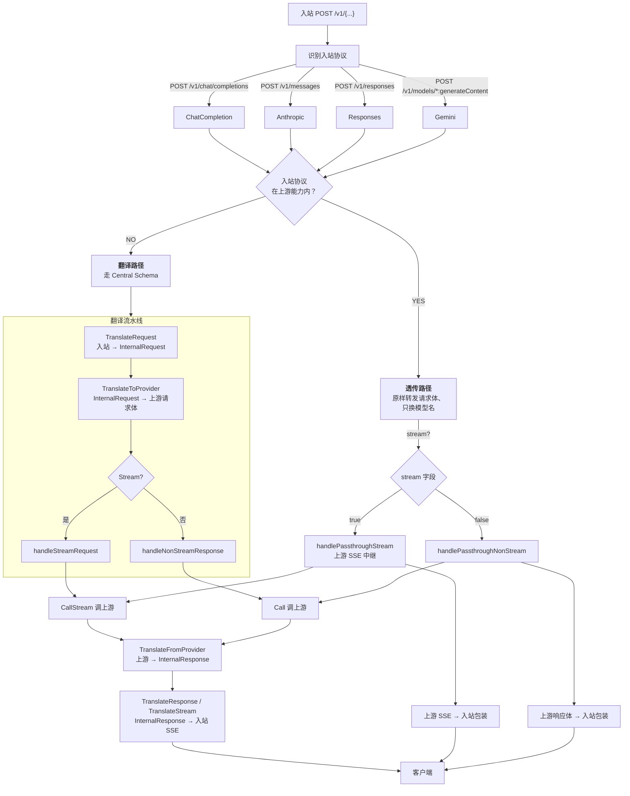
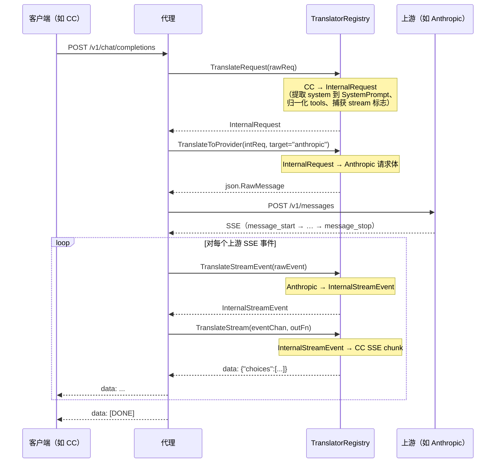
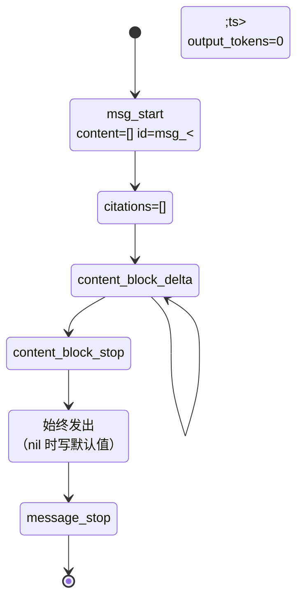
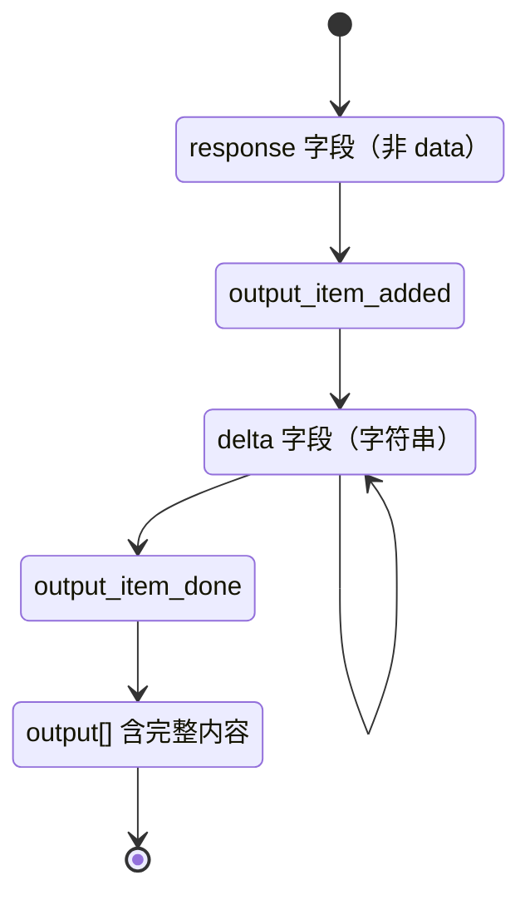
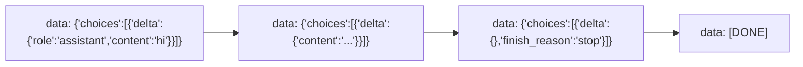
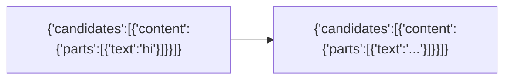
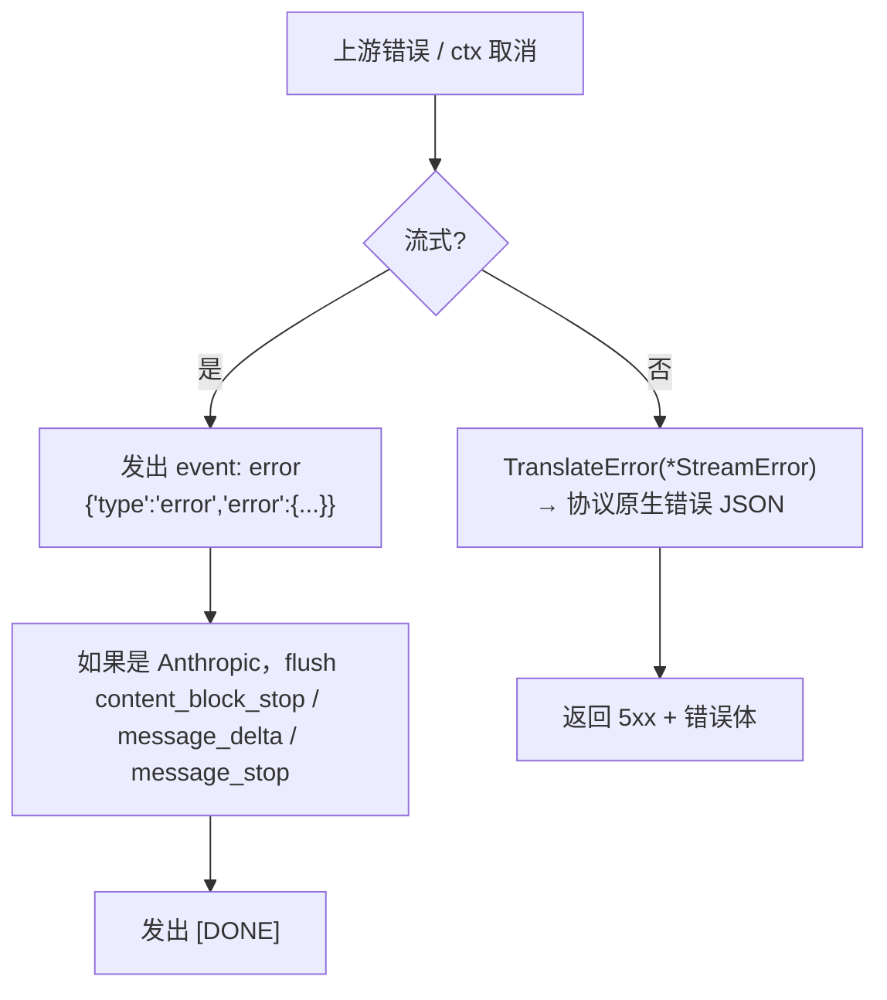

# Agent-Proxy — 请求生命周期

> 一个请求经过代理的端到端路径：识别 → 路由 →（透传或翻译）→ 上游 → 响应。
>
> [`ARCHITECTURE.md`](ARCHITECTURE.md) 的配套文档。逐协议字段差异见 [`PROTOCOL_COMPARISON.md`](PROTOCOL_COMPARISON.md)。

---

## 1. 决策树



翻译路径的关键顺序：**消息格式转换先于流 / 非流决策**。`InternalRequest.Stream` 在 `TranslateRequest` 阶段捕获并保留，贯穿到最终 handler 分发。

---

## 2. 透传路径（零损耗）

当入站协议匹配上游真实支持的一种时（例如 CC 客户端打到一个 OpenAI 兼容上游），代理跳过所有翻译：

```mermaid
sequenceDiagram
    participant C as 客户端
    participant P as 代理（透传）
    participant U as 上游

    C->>P: POST /v1/chat/completions
    Note over P: 模型别名解析 假→真
    P->>U: POST &lt;base&gt;/&lt;pathPrefix&gt;/chat/completions
    U-->>P: 响应体（JSON 或 SSE）
    Note over P: 模型别名解析 真→假
    P-->>C: 响应体
```

两种变体：

- **`handlePassthroughStream`** —— 中继上游 SSE。如果上游返回的是非流 JSON 而客户端要求 `stream: true`，代理**动态包装**成 SSE。
- **`handlePassthroughNonStream`** —— 转发上游 JSON 响应。如果上游返回的是 SSE 而客户端要求 `stream: false`，代理**动态拆包** SSE、聚合后返回单条 JSON。

正是这种自适应流 / 非流行为，让透传客户端永远察觉不到代理的存在。

---

## 3. 翻译路径（完整 Central Schema 往返）



非流变体把上面的 loop 折叠为单次 `Call` → `TranslateFromProvider` → `TranslateResponse` 链。

---

## 4. 各协议 SSE 生命周期

每个协议都有严格的事件序列。翻译器发出完整序列（含取消安全结束），这样严格客户端（Claude Code、Codex）不会拒绝。

### Anthropic



### Responses



### ChatCompletion



### Gemini



Gemini 的 SSE 是纯 JSON 行（无 `event:` 字段、无 `type` 字段）—— 代理在翻译边界归一化它。

---

## 5. 错误路径



`TranslateError` 是每协议一份（`ErrorTranslator` 接口），让响应形态匹配客户端预期。

---

## 6. Usage 字段兼容

Claude Code 校验 `usage.input_tokens` / `usage.output_tokens`。缺失或 `null` 会 crash 客户端。

- **透传**：`quick.go:fixNullUsageInResponse` 原地修补 null / 缺失 usage：
  - Anthropic 形态（含 `content[]`）→ `{"input_tokens":0,"output_tokens":0}`
  - CC 形态（含 `choices[]`）→ `{"prompt_tokens":0,"completion_tokens":0,"total_tokens":0}`
  - 未知形态 → 两种字段都写，安全兜底
- **翻译**：`InternalResponse.Usage` 必须始终是非空对象（翻译器保证）。
- **CC SSE**：代理注入 `stream_options:{include_usage:true}`，让支持的上游在流里返回 usage 数据。
