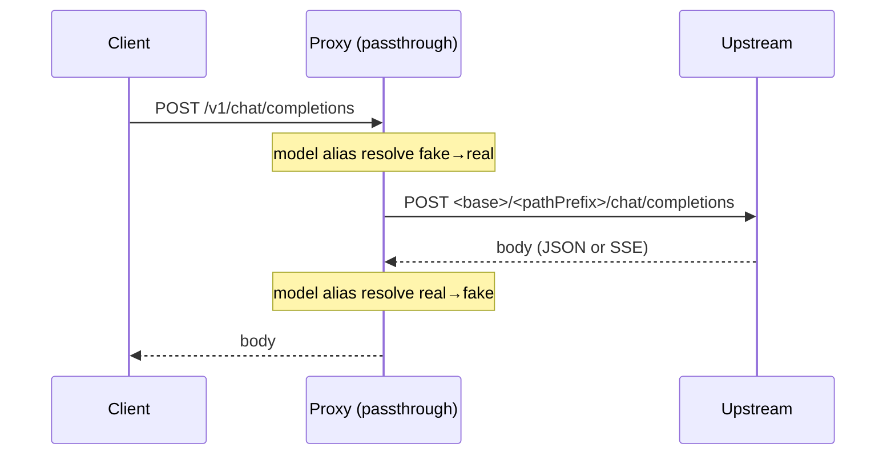
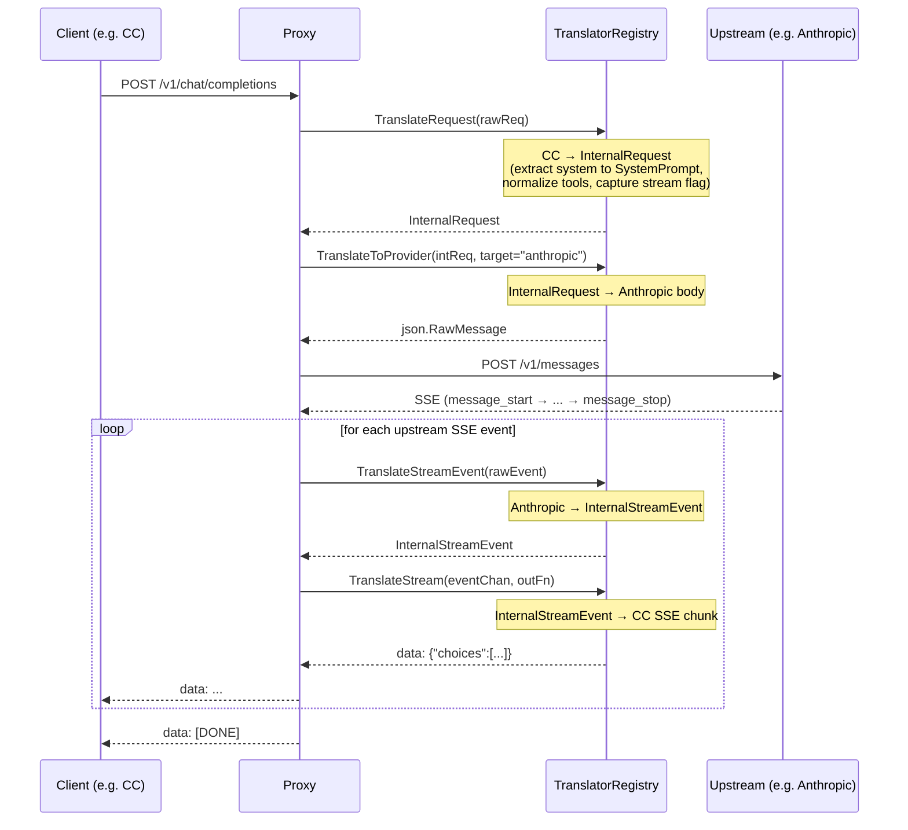
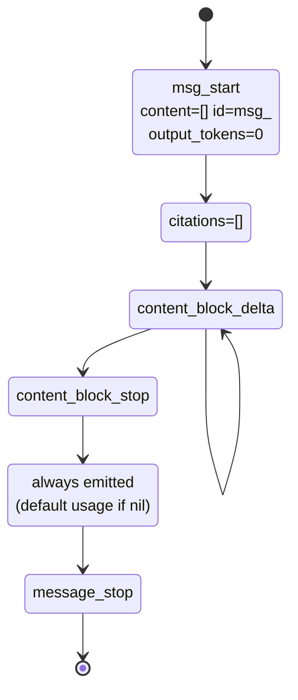
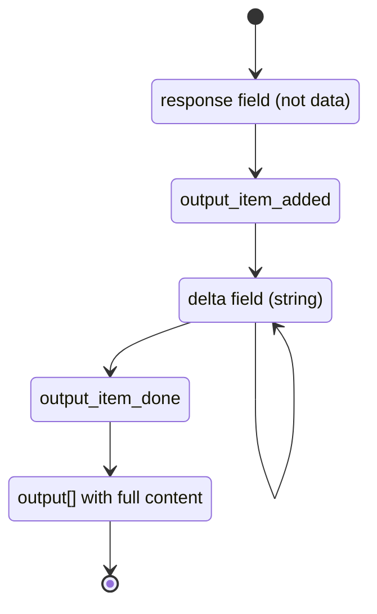

# Agent-Proxy — Request Lifecycle

> End-to-end path a request takes through the proxy: detection → routing → (passthrough or translate) → upstream → response.
>
> Companion to [`ARCHITECTURE.md`](ARCHITECTURE.md). For per-protocol field differences see [`PROTOCOL_COMPARISON.md`](PROTOCOL_COMPARISON.md).

---

## 1. The Decision Tree

```mermaid
flowchart TD
    A[Ingress POST /v1/{...}] --> B[Detect ingress protocol]

    B -->|/v1/chat/completions| CC[ChatCompletion]
    B -->|/v1/messages| AN[Anthropic]
    B -->|/v1/responses| RS[Responses]
    B -->|/v1/models/*:generateContent| GM[Gemini]

    CC & AN & RS & GM --> C{Ingress protocol<br/>in upstream capabilities?}

    C -->|YES| PASS[<b>Passthrough path</b><br/>forward body verbatim,<br/>only swap model name]
    C -->|NO| TRAN[<b>Translate path</b><br/>through Central Schema]

    subgraph T["Translate pipeline"]
        TR1[TranslateRequest<br/>ingress → InternalRequest]
        TR2[TranslateToProvider<br/>InternalRequest → provider body]
        TR3{Stream?}
        TR3 -->|yes| HANdleStream[handleStreamRequest]
        TR3 -->|no| HANdleNon[handleNonStreamResponse]
        TR1 --> TR2 --> TR3
    end

    TRAN --> T

    PASS -->|stream?| PS{stream field}
    PS -->|true| PSS[handlePassthroughStream<br/>upstream SSE relay]
    PS -->|false| PNN[handlePassthroughNonStream]

    HANdleStream --> UP[CallStream to upstream]
    HANdleNon --> UP2[Call to upstream]
    PSS --> UP
    PNN --> UP2

    UP --> FR[TranslateFromProvider<br/>upstream → InternalResponse]
    UP2 --> FR

    FR --> OUT[TranslateResponse / TranslateStream<br/>InternalResponse → ingress SSE]
    PSS --> OUTP[upstream SSE → ingress wrapper]
    PNN --> OUTN[upstream body → ingress wrapper]

    OUT --> CLIENT[Client]
    OUTP --> CLIENT
    OUTN --> CLIENT
```

The critical order in the translate path: **message-format conversion happens before the stream/non-stream decision**. `InternalRequest.Stream` is captured during `TranslateRequest` and preserved through to the final handler dispatch.

---

## 2. Passthrough Path (zero-loss)

When the ingress protocol matches one the upstream actually speaks (e.g., a CC client hitting an OpenAI-compatible upstream), the proxy skips all translation:



Two variants:

- **`handlePassthroughStream`** — relays upstream SSE. If the upstream returned non-stream JSON while the client asked for `stream: true`, the proxy **wraps** the one-shot response into SSE on the fly.
- **`handlePassthroughNonStream`** — forwards the upstream JSON response. If the upstream returned SSE while the client asked for `stream: false`, the proxy **unwraps** the SSE, aggregates, and returns a single JSON response.

This adaptive stream-vs-non-stream behavior is why passthrough clients never notice the proxy.

---

## 3. Translate Path (full Central Schema round-trip)



The non-stream variant collapses the loop into a single `Call` → `TranslateFromProvider` → `TranslateResponse` chain.

---

## 4. SSE Lifecycle per Protocol

Each protocol has a strict event sequence. The translators emit the full sequence (including cancellation-safe teardown) so strict clients (Claude Code, Codex) don't reject the stream.

### Anthropic



### Responses



### ChatCompletion

```mermaid
flowchart LR
    A[data: {"choices":[{"delta":{"role":"assistant","content":"hi"}}]}]
    B[data: {"choices":[{"delta":{"content":"..."}}]}]
    C[data: {"choices":[{"delta":{},"finish_reason":"stop"}]}]
    D[data: [DONE]]
    A --> B --> C --> D
```

### Gemini

```mermaid
flowchart LR
    A[{"candidates":[{"content":{"parts":[{"text":"hi"}]}}]}]
    B[{"candidates":[{"content":{"parts":[{"text":"..."}]}}]}]
    A --> B
```

Gemini's SSE is plain JSON lines (no `event:` field, no `type` field) — the proxy normalizes this on the translate boundary.

---

## 5. Error Path

```mermaid
flowchart TD
    ERR[Upstream error / ctx cancellation] --> E{streaming?}
    E -->|yes| E1[emit event: error<br/>{"type":"error","error":{...}}]
    E1 --> E2[flush content_block_stop / message_delta / message_stop if Anthropic]
    E2 --> E3[emit [DONE]]
    E -->|no| E4[TranslateError(*StreamError)<br/>→ protocol-native error JSON]
    E4 --> E5[return 5xx with error body]
```

`TranslateError` is per-protocol (`ErrorTranslator` interface) so the response shape matches what the client expects.

---

## 6. Usage-Field Compatibility

Claude Code validates `usage.input_tokens` / `usage.output_tokens`. Missing or `null` usage crashes the client.

- **Passthrough**: `quick.go:fixNullUsageInResponse` patches null/missing usage inline:
  - Anthropic-shaped (has `content[]`): `{"input_tokens":0,"output_tokens":0}`
  - CC-shaped (has `choices[]`): `{"prompt_tokens":0,"completion_tokens":0,"total_tokens":0}`
  - Unknown shape: writes both sets of fields as a safe fallback.
- **Translate**: `InternalResponse.Usage` must always be a non-null object (translators guarantee this).
- **CC SSE**: the proxy injects `stream_options:{include_usage:true}` so upstreams that support it return usage data in the stream.